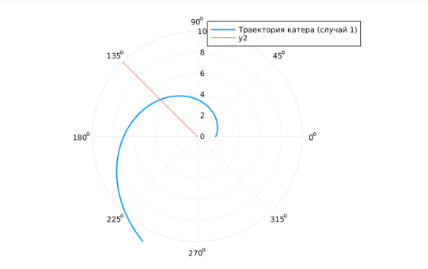
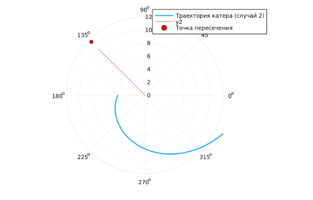

---
## Front matter
lang: ru-RU
title: Лабораторная работа №2
subtitle: Задача о погоне
author:
  - Эспиноса Василита К.М.
institute:
  - Российский университет дружбы народов, Москва, Россия

## i18n babel
babel-lang: russian
babel-otherlangs: english

## Formatting pdf
toc: false
toc-title: Содержание
slide_level: 2
aspectratio: 169
section-titles: true
theme: metropolis
header-includes:
 - \metroset{progressbar=frametitle,sectionpage=progressbar,numbering=fraction}
---

# Информация

## Докладчик

:::::::::::::: {.columns align=center}
::: {.column width="70%"}

  * Эспиноса Василита Кристина Микаела
  * студентка
  * Российский университет дружбы народов
  * [1032224624@pfur.ru](mailto:1032224624@pfur.ru)
  * <https://github.com/crisespinosa/>
:::
::: {.column width="30%"}


:::
::::::::::::::

# Цель работы

Построить математическую модель для выбора правильной стратегии при решении примера задаче о погоне.

# Задание
Вариант 5
На море в тумане катер береговой охраны преследует лодку браконьеров.
Через определенный промежуток времени туман рассеивается, и лодка
обнаруживается на расстоянии 6,2 км от катера. Затем лодка снова скрывается в
тумане и уходит прямолинейно в неизвестном направлении. Известно, что скорость
катера в 2,5 раза больше скорости браконьерской лодки.
1. Запишите уравнение, описывающее движение катера, с начальными
условиями для двух случаев (в зависимости от расположения катера
относительно лодки в начальный момент времени).
2. Постройте траекторию движения катера и лодки для двух случаев.
3. Найдите точку пересечения траектории катера и лодки

# Теоретическое введение

Кривая погони — кривая, представляющая собой решение задачи о «погоне», которая ставится следующим образом. Пусть точка A равномерно движется по некоторой заданной кривой. Требуется найти траекторию равномерного движения точки P такую, что касательная, проведённая к траектории в любой момент движения, проходила бы через соответствующее этому моменту положение точки A [@wiki:bash].

# Выполнение лабораторной работы

Построение модели:

```julia
using DifferentialEquations, Plots;
k = 6.2

r0 = k / 3.5    # случай 1
theta0 = (0.0, 2π)
fi = 3π / 4

t = (0.0, 50.0)

x(t) = tan(fi) * t

f(r, p, t) = r / sqrt(5.25)

prob = ODEProblem(f, r0, theta0)
sol = solve(prob, saveat=0.01)

plot(sol.t, sol.u, proj=:polar, lims=(0, 10), label="Траектория катера (случай 1)", linewidth=2)


r_lims = 0:0.1:10                # distancias (cómo de lejos va la lancha)
theta_lims = [fi for _ in r_lims]  # ángulo constante
plot!(theta_lims, r_lims, proj=:polar)

y(theta) = (620 / 350) * exp(theta / sqrt(5.25))


r_intersection = y(fi)
println("Точка пересечения: r = ", r_intersection)
```
# Выполнение лабораторной работы

В результате получаем такой рисунок (рис. [-@fig:001]):

{#fig:001 width=70%}

точка пересечения лодки и катера для 1 случая = 4.9535966308266906

# Выполнение лабораторной работы

Теперь перейдем к решению в случае 2.

```julia
using DifferentialEquations, Plots


k = 6.2


r0_2 = k / 1.5              # = 620 / 150
theta0_2 = (-π, π)


fi = 3π / 4


f(r, p, t) = r / sqrt(5.25)


prob2 = ODEProblem(f, r0_2, theta0_2)
sol2 = solve(prob2, saveat=0.01)


plot(sol2.t, sol2.u, proj=:polar, lims=(0, 12), label="Траектория катера (случай 2)", linewidth=2)


r_lims = 0:0.1:10 
theta_lims = [fi for _ in r_lims] 

plot!(theta_lims, r_lims, proj=:polar)


y2(theta) = (620 / 150) * exp((theta + π) / sqrt(5.25))


r_intersection_2 = y2(fi - π)
println("Точка пересечения (случай 2): r = ", r_intersection_2)
scatter!([fi], [r_intersection_2], proj=:polar, label="Точка пересечения", color=:red)
```

точка пересечения лодки и катера для 2 случая= 11.558392138595613

# Выполнение лабораторной работы

{#fig:002 width=70%}
# Выводы

В процессе выполнения данной лабораторной работы я построила математическую модель для выбора правильной стратегии при решении примера задаче о погоне.