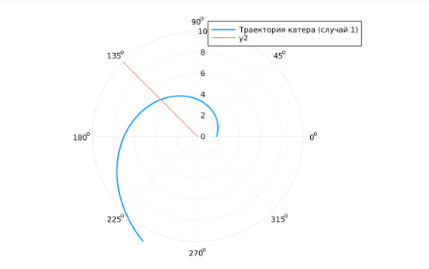
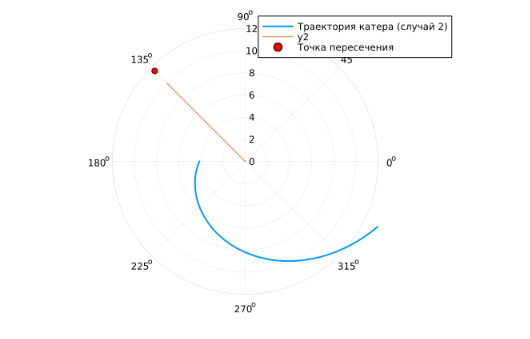

---
## Front matter
title: "Лабораторная работа №2"
subtitle: "Задача о погоне"
author: "Эспиноса Василита Кристина Микаела"

## Generic otions
lang: ru-RU
toc-title: "Содержание"

## Bibliography
bibliography: bib/cite.bib
csl: pandoc/csl/gost-r-7-0-5-2008-numeric.csl

## Pdf output format
toc: true # Table of contents
toc-depth: 2
lof: true # List of figures
lot: true # List of tables
fontsize: 12pt
linestretch: 1.5
papersize: a4
documentclass: scrreprt
## I18n polyglossia
polyglossia-lang:
  name: russian
  options:
	- spelling=modern
	- babelshorthands=true
polyglossia-otherlangs:
  name: english
## I18n babel
babel-lang: russian
babel-otherlangs: english
## Fonts
mainfont: IBM Plex Serif
romanfont: IBM Plex Serif
sansfont: IBM Plex Sans
monofont: IBM Plex Mono
mathfont: STIX Two Math
mainfontoptions: Ligatures=Common,Ligatures=TeX,Scale=0.94
romanfontoptions: Ligatures=Common,Ligatures=TeX,Scale=0.94
sansfontoptions: Ligatures=Common,Ligatures=TeX,Scale=MatchLowercase,Scale=0.94
monofontoptions: Scale=MatchLowercase,Scale=0.94,FakeStretch=0.9
mathfontoptions:
## Biblatex
biblatex: true
biblio-style: "gost-numeric"
biblatexoptions:
  - parentracker=true
  - backend=biber
  - hyperref=auto
  - language=auto
  - autolang=other*
  - citestyle=gost-numeric
## Pandoc-crossref LaTeX customization
figureTitle: "Рис."
tableTitle: "Таблица"
listingTitle: "Листинг"
lofTitle: "Список иллюстраций"
lotTitle: "Список таблиц"
lolTitle: "Листинги"
## Misc options
indent: true
header-includes:
  - \usepackage{indentfirst}
  - \usepackage{float} # keep figures where there are in the text
  - \floatplacement{figure}{H} # keep figures where there are in the text
---

# Цель работы

Построить математическую модель для выбора правильной стратегии при решении примера задаче о погоне.

# Задание
Вариант 5
На море в тумане катер береговой охраны преследует лодку браконьеров.
Через определенный промежуток времени туман рассеивается, и лодка
обнаруживается на расстоянии 6,2 км от катера. Затем лодка снова скрывается в
тумане и уходит прямолинейно в неизвестном направлении. Известно, что скорость
катера в 2,5 раза больше скорости браконьерской лодки.
1. Запишите уравнение, описывающее движение катера, с начальными
условиями для двух случаев (в зависимости от расположения катера
относительно лодки в начальный момент времени).
2. Постройте траекторию движения катера и лодки для двух случаев.
3. Найдите точку пересечения траектории катера и лодки

# Теоретическое введение

Кривая погони — кривая, представляющая собой решение задачи о «погоне», которая ставится следующим образом. Пусть точка A равномерно движется по некоторой заданной кривой. Требуется найти траекторию равномерного движения точки P такую, что касательная, проведённая к траектории в любой момент движения, проходила бы через соответствующее этому моменту положение точки A [@wiki:bash].

# Выполнение лабораторной работы
```markdown
Запишем уравнение, описывающее движение катера, с начальными условиями для двух случаев (в зависимости от расположения катера относительно лодки в начальный момент времени).

Примем, что  
`t₀ = 0`, `x₀ = 0` — место нахождения лодки браконьеров в момент обнаружения,  
`xₖ₀ = k = 6.2` км — расстояние от катера береговой охраны до лодки в этот момент.

Введём полярные координаты. За полюс примем точку обнаружения лодки. Полярная ось `r` проходит через точку, где находится катер. В этой системе координат задача упрощается.

Траектория катера должна быть построена так, чтобы в момент перехвата он находился на том же расстоянии от полюса и под тем же углом `θ`, что и лодка. Поэтому сначала катер должен двигаться по прямой, чтобы оказаться на том же расстоянии от полюса, что и лодка. После этого он начинает двигаться по спирали, удаляясь от полюса с той же радиальной скоростью, что и лодка.

Пусть через время `t` лодка и катер оказываются на расстоянии `x` от полюса.

- Лодка проходит: `x`
- Катер:
  - `k - x`, если он позади
  - `k + x`, если он впереди

Так как время одно и то же, приравниваем:

**Случай 1 (катер позади лодки):**

```
x / v = (k - x) / (2.5 * v)
⇒ x = k / 3.5 = 6.2 / 3.5 ≈ 1.77 км
```

**Случай 2 (катер впереди лодки):**

```
x / v = (k + x) / (2.5 * v)
⇒ x = k / 1.5 = 6.2 / 1.5 ≈ 4.13 км
```


### Переход к полярной модели

После достижения одного и того же расстояния от полюса, катер начинает двигаться по спирали.

Разложим его скорость на:

- Радиальную: `vᵣ = dr/dt = v`
- Тангенциальную: `v_τ = r · dθ/dt`

Так как полная скорость катера `2.5v`, по теореме Пифагора:

```
v_τ = √((2.5v)² - v²) = √(6.25v² - v²) = √5.25 · v
⇒ r · dθ/dt = √5.25 · v
```

### Итоговая система дифференциальных уравнений

```
dr/dt = v  
dθ/dt = (√5.25 · v) / r
```
С начальными условиями:

- Случай 1:  
  `r₀ = 6.2 / 3.5`, `θ₀ = 0`

- Случай 2:  
  `r₀ = 6.2 / 1.5`, `θ₀ = -π`

Исключив `t`, получаем:

```
dr/dθ = r / √5.25
```

Это уравнение описывает спиральную траекторию катера в полярных координатах.
```
Построение модели:

```julia
using DifferentialEquations, Plots;
# Расстояние от лодки до катера
k = 6.2
# Начальные условия для 1 и 2 случаев
r0 = k / 3.5    # случай 1
theta0 = (0.0, 2π)
theta0_2 = (-π, π)

# Угол движения лодки браконьеров
fi = 3π / 4

# Время моделирования (не используется явно, но может пригодиться)
t = (0.0, 50.0)

# Функция, описывающая движение лодки браконьеров (прямая линия под углом fi)
x(t) = tan(fi) * t

# Функция, описывающая движение катера береговой охраны
f(r, p, t) = r / sqrt(5.25)

# Постановка задачи и решение ОДУ для случая 1
prob = ODEProblem(f, r0, theta0)
sol = solve(prob, saveat=0.01)

# Построение траектории катера
plot(sol.t, sol.u, proj=:polar, lims=(0, 10), label="Траектория катера (случай 1)", linewidth=2)

# Построение траектории лодки браконьеров
r_lims = 0:0.1:10                # distancias (cómo de lejos va la lancha)
theta_lims = [fi for _ in r_lims]  # ángulo constante
plot!(theta_lims, r_lims, proj=:polar)

# точное решение для случая 1
y(theta) = (620 / 350) * exp(theta / sqrt(5.25))


# точка пересечения
r_intersection = y(fi)
println("Точка пересечения: r = ", r_intersection)
```

В результате получаем такой рисунок (рис. [-@fig:001]):

{#fig:001 width=70%}

точка пересечения лодки и катера для 1 случая = 4.9535966308266906

Теперь перейдем к решению в случае 2.

```julia
using DifferentialEquations, Plots

# Расстояние от лодки до катера
k = 6.2

# Начальные условия для случая 2
r0_2 = k / 1.5              # = 620 / 150
theta0_2 = (-π, π)

# Угол движения лодки
fi = 3π / 4

# Функция описания движения катера
f(r, p, t) = r / sqrt(5.25)

# Постановка задачи и решение ОДУ для случая 2
prob2 = ODEProblem(f, r0_2, theta0_2)
sol2 = solve(prob2, saveat=0.01)

# Построение траектории катера
plot(sol2.t, sol2.u, proj=:polar, lims=(0, 12), label="Траектория катера (случай 2)", linewidth=2)

# Траектория лодки браконьеров (прямая под углом fi)
r_lims = 0:0.1:10 
theta_lims = [fi for _ in r_lims] 

plot!(theta_lims, r_lims, proj=:polar)

# Точное решение (аналитическая формула)
y2(theta) = (620 / 150) * exp((theta + π) / sqrt(5.25))

# Точка пересечения с лодкой
r_intersection_2 = y2(fi - π)
println("Точка пересечения (случай 2): r = ", r_intersection_2)
scatter!([fi], [r_intersection_2], proj=:polar, label="Точка пересечения", color=:red)
```

точка пересечения лодки и катера для 2 случая= 11.558392138595613

{#fig:002 width=70%}
# Выводы

В процессе выполнения данной лабораторной работы я построила математическую модель для выбора правильной стратегии при решении примера задаче о погоне.

# Список литературы{.unnumbered}

::: {#refs}
:::
