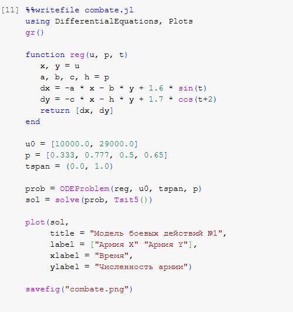
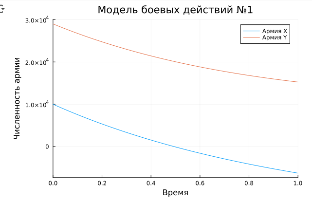
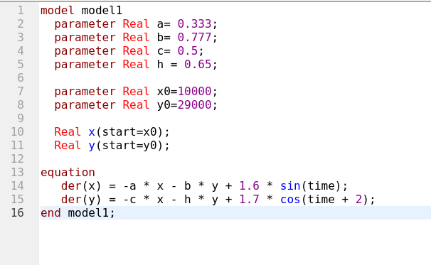
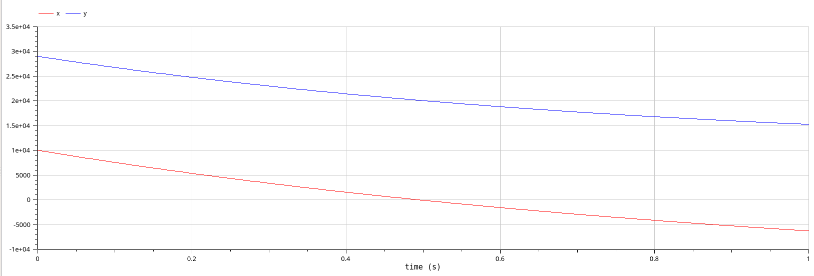
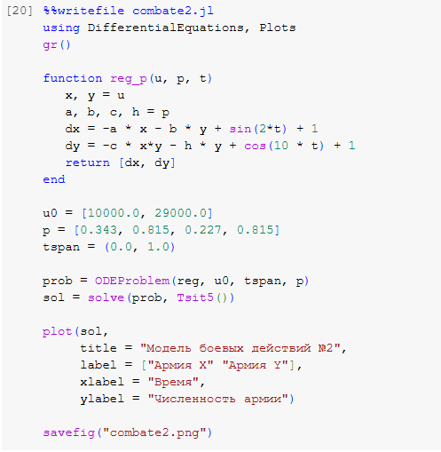
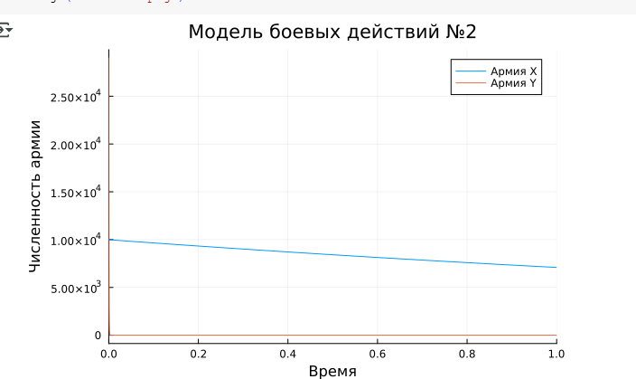
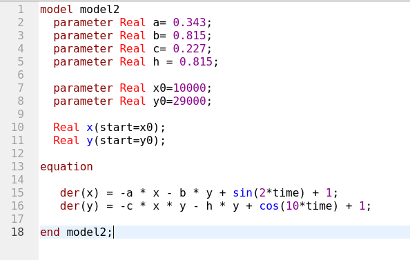
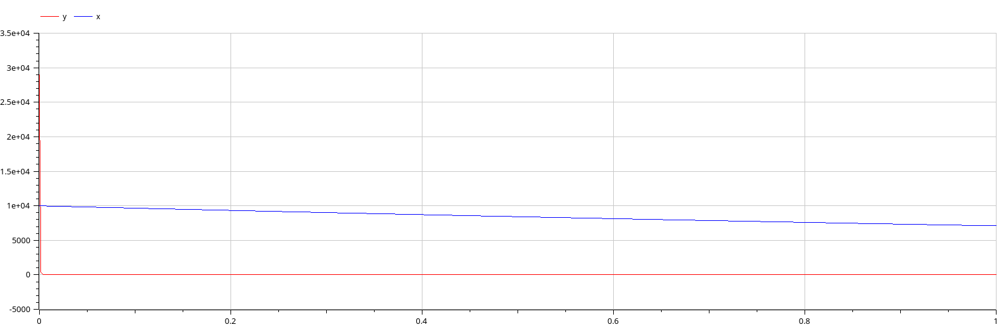

---
## Front matter
lang: ru-RU
title: "Лабораторная работа №3"
subtitle: Модель боевых действий
author:
  - Эспиноса Василита К.М.
institute:
  - Российский университет дружбы народов, Москва, Россия

date: 22/03/2025

## i18n babel
babel-lang: russian
babel-otherlangs: english

## Formatting pdf
toc: false
toc-title: Содержание
slide_level: 2
aspectratio: 169
section-titles: true
theme: metropolis
header-includes:
 - \metroset{progressbar=frametitle,sectionpage=progressbar,numbering=fraction}
---

# Информация

## Докладчик

:::::::::::::: {.columns align=center}
::: {.column width="70%"}

  * Эспиноса Василита Кристина Микаела
  * студентка
  * Российский университет дружбы народов
  * [1032224624@pfur.ru](mailto:1032224624@pfur.ru)
  * <https://github.com/crisespinosa/>

:::
::: {.column width="30%"}

:::
::::::::::::::

# Цель работы

Построить модель боевых действий на языке прогаммирования Julia и посредством ПО OpenModelica.

# Задание

ежду страной Х и страной У идет война. Численность состава войск
исчисляется от начала войны, и являются временными функциями x(t) и y(t). В
начальный момент времени страна Х имеет армию численностью 10 000 человек, а
в распоряжении страны У армия численностью в 29 000 человек. Для упрощения
модели считаем, что коэффициенты
a,b,c,h постоянны. Также считаем P(t) и Q(t) непрерывные функции.
Постройте графики изменения численности войск армии Х и армии У для
следующих случаев:

# Задание

{#fig:001 width=70%}

# Выполнение лабораторной работы

## Модель боевых действий между регулярными войсками

В данной **модели боевых действий №1** рассматривается взаимодействие двух армий X и Y в течение одного дня. Потери армий описываются системой дифференциальных уравнений, где:

- члены `−0.333 x(t)` и `−0.65 y(t)` отражают **небоевые потери**, связанные с внешними факторами: болезнями, логистическими проблемами, моральным состоянием и т.д.;
- члены `−0.777 y(t)` и `−0.5 x(t)` моделируют **боевые потери**, зависящие от численности противника и эффективности наступательных действий;
- добавочные функции `1.6 sin(t)` и `1.7 cos(t + 2)` учитывают возможные **внешние воздействия**, такие как подкрепления, изменение погодных условий или морального духа армий X и Y соответственно.

# Выполнение лабораторной работы

{#fig:001 width=70%}

# Выполнение лабораторной работы

На основании численного решения видно, что:

- **Армия X** (синяя линия) стремительно теряет численность — с 10 000 в начале до почти **нуля** к концу дня. Это указывает на высокую уязвимость армии X к боевым и небоевым потерям.
- **Армия Y** (оранжевая линия), несмотря на потери, сохраняет численность выше 20 000, начиная с 29 000. Это демонстрирует **большую устойчивость** армии Y.

{#fig:002 width=70%}

# Выполнение лабораторной работы

Теперь давайте построим эту же модель посредством OpenModelica.

{#fig:003 width=70%}

# Выполнение лабораторной работы

В результате получаем слудющий график изменения численности армий

{#fig:004 width=70%}

## Модель ведение боевых действий с участием регулярных войск и партизанских отрядов

В модели наша система дифференциальных уравнений включает:

- члены `−0.343 x(t)` и `−0.815 y(t)` — это **небоевые потери**, связанные с логистикой, болезнями и другими факторами;
- член `−0.227 x(t) * y(t)` во втором уравнении — это **нелинейный боевой вклад**, моделирующий интенсивное взаимодействие между армиями, особенно при больших значениях \( x \) и \( y \);
- слагаемые `sin(2t) + 1` и `cos(10t) + 1` представляют **внешние влияния и подкрепления**, воздействующие на армии с различной частотой.

# Выполнение лабораторной работы

{#fig:005 width=70%}

# Выполнение лабораторной работы

На основании численного решения видно, что:

- **Армия X** (синяя линия) начинает с 10 000 солдат и **медленно теряет численность**, заканчивая примерно на уровне 8 500–9 000. Это говорит о контролируемом уровне потерь и устойчивости.
- **Армия Y** (оранжевая линия), несмотря на начальную численность в 29 000, практически **мгновенно теряет всю боеспособность**. Численность падает до нуля в течение первых мгновений симуляции.

{#fig:006 width=70%}

# Выполнение лабораторной работы

Теперь давайте построим эту же модель посредством OpenModelica.

{#fig:007 width=70%}

# Выполнение лабораторной работы

В результате получаем слудющий график изменения численности армий

{#fig:008 width=70%}

# Выводы

В процессе выполнения данной лабораторной работы я построила модель боевых действий на языке прогаммирования Julia и посредством ПО OpenModelica, а также провела сравнительный анализ.
