---
## Front matter
lang: ru-RU
title: "Лабораторная работа №4"
subtitle: Модель гармонических колебаний
author:
  - Эспиноса Василита К.М.
institute:
  - Российский университет дружбы народов, Москва, Россия

date: 05/04/2025

## i18n babel
babel-lang: russian
babel-otherlangs: english

## Formatting pdf
toc: false
toc-title: Содержание
slide_level: 2
aspectratio: 169
section-titles: true
theme: metropolis
header-includes:
 - \metroset{progressbar=frametitle,sectionpage=progressbar,numbering=fraction}
---

# Информация

## Докладчик

:::::::::::::: {.columns align=center}
::: {.column width="70%"}

  * Эспиноса Василита Кристина Микаела
  * студентка
  * Российский университет дружбы народов
  * [1032224624@pfur.ru](mailto:1032224624@pfur.ru)
  * <https://github.com/crisespinosa/>

:::
::: {.column width="30%"}

:::
::::::::::::::

# Цель работы

Построить математическую модель гармонического осциллятора на языке прогаммирования Julia и посредством ПО OpenModelica.

# Задание

Постройте фазовый портрет гармонического осциллятора и решение уравнения
гармонического осциллятора для следующих случаев

- Колебания гармонического осциллятора без затуханий и без действий внешней
силы 

- Колебания гармонического осциллятора c затуханием и без действий внешней
силы

 Колебания гармонического осциллятора c затуханием и под действием внешней
силы

# Выполнение лабораторной работы

# Модель колебаний гармонического осциллятора без затуханий и без действий внешней силы

Для начала реализуем эту модель на языке программирования Julia.

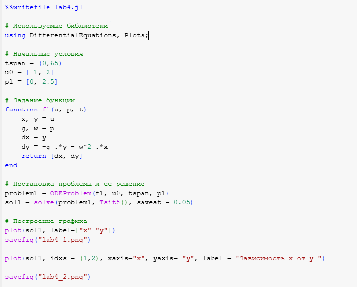{#fig:001 width=70%}

# Модель колебаний гармонического осциллятора без затуханий и без действий внешней силы

В результате получаем следующие графики решения уравнения гармонического осциллятора (рис. [-@fig:002]) и его фазового портрета (рис. [-@fig:003]).

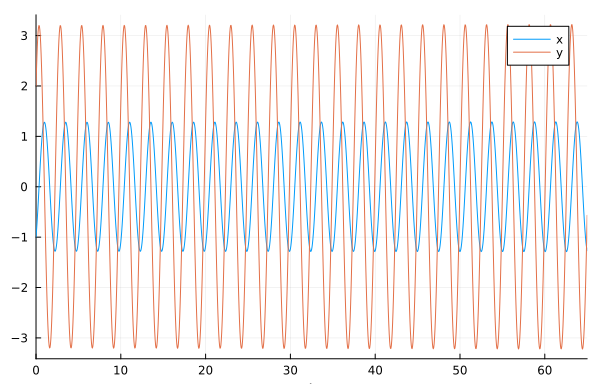{#fig:002 width=70%}

# Модель колебаний гармонического осциллятора без затуханий и без действий внешней силы

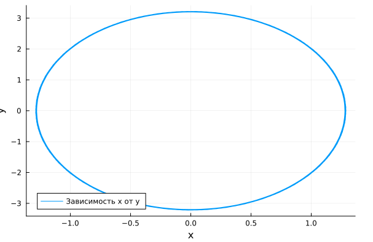{#fig:003 width=70%}

Можно заметить, что колебание осциллятора периодично, график не задухает.

# Модель колебаний гармонического осциллятора без затуханий и без действий внешней силы

Теперь реализуем эту модель посредством OpenModelica.

model lab4_1

  parameter Real g = 0;
  parameter Real w = 2.5;
  parameter Real x0 = -1;
  parameter Real y0 = 2;
  Real x(start=x0);
  Real y(start=y0);
equation
    der(x) = y;
    der(y) = -g .*y - w^2 .*x;
end lab4_1;

# Модель колебаний гармонического осциллятора без затуханий и без действий внешней силы
В результате получаем следующие графики решения уравнения гармонического осциллятора (рис. [-@fig:004]) и его фазового портрета (рис. [-@fig:005]).

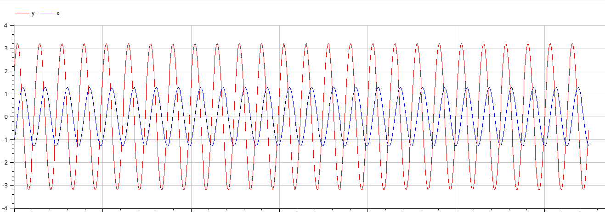{#fig:004 width=70%}

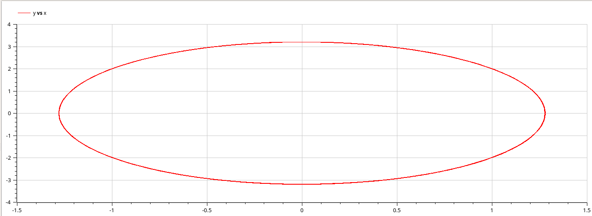{#fig:005 width=70%}

# Модель колебаний гармонического осциллятора c затуханием и без действий внешней силы

Pеализуем эту модель на языке программирования Julia.

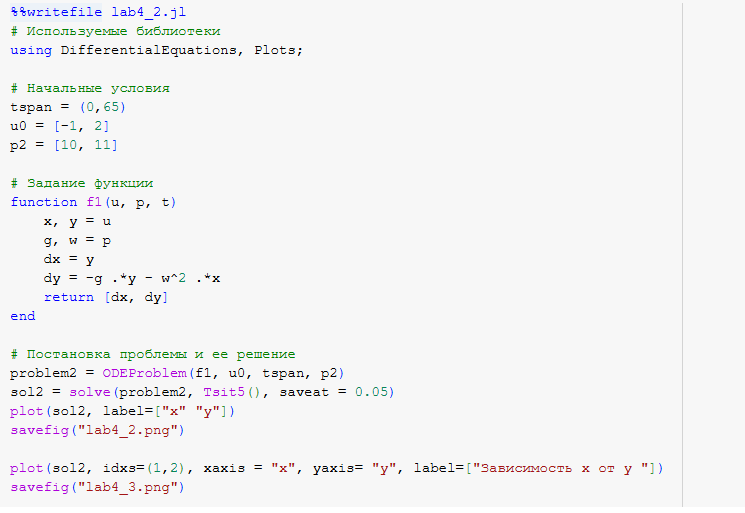{#fig:006 width=70%}

# Модель колебаний гармонического осциллятора c затуханием и без действий внешней силы

В результате получаем следующие графики решения уравнения гармонического осциллятора (рис. [-@fig:007]) и его фазового портрета (рис. [-@fig:008]).

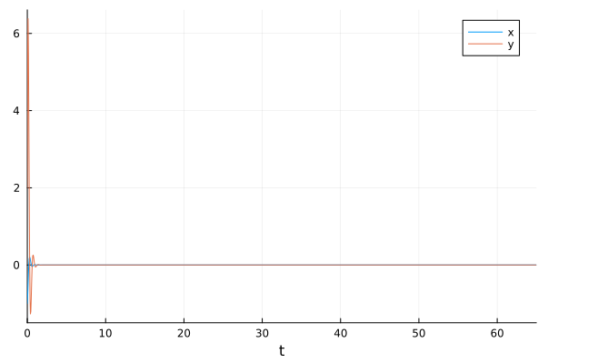{#fig:007 width=70%}

# Модель колебаний гармонического осциллятора c затуханием и без действий внешней силы

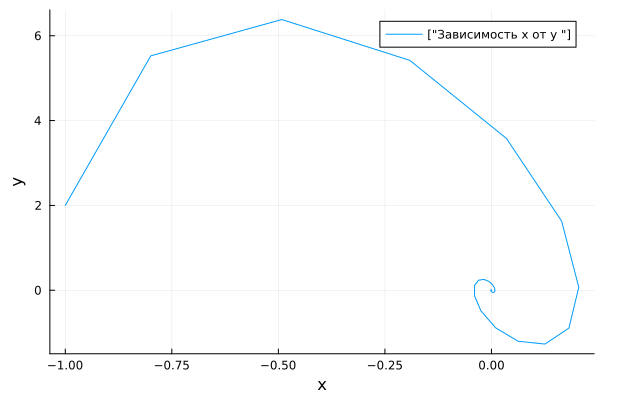{#fig:008 width=70%}

В этом случае сначала происходят колебания осциллятора, а затем график затухает, поскольку у нас есть параметр, отвечающий за потери энергии.

# Модель колебаний гармонического осциллятора c затуханием и без действий внешней силы

Теперь реализуем эту модель посредством OpenModelica.

model lab4_2
  parameter Real g = 10;
  parameter Real w = 11;
  parameter Real x0 = -1;
  parameter Real y0 = 2;
  Real x(start=x0);
  Real y(start=y0);
equation
    der(x) = y;
    der(y) = -g .*y - w^2 .*x;
end lab4_2;

# Модель колебаний гармонического осциллятора c затуханием и без действий внешней силы

В результате получаем следующие графики решения уравнения гармонического осциллятора (рис. [-@fig:009]) и его фазового портрета (рис. [-@fig:010]).

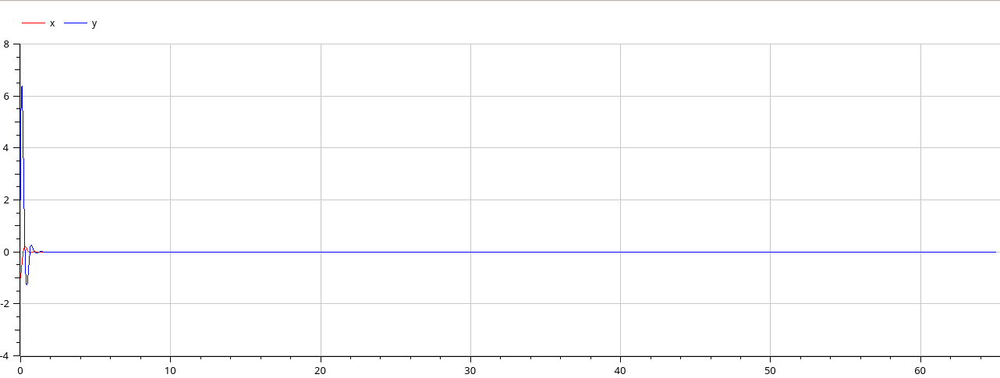{#fig:009 width=70%}

# Модель колебаний гармонического осциллятора c затуханием и без действий внешней силы

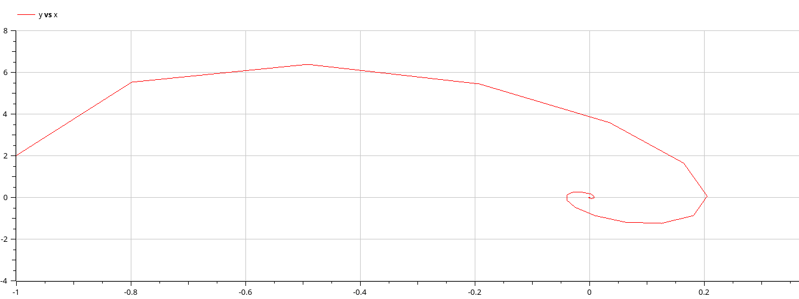{#fig:0010 width=70%}

# Модель колебаний гармонического осциллятора c затуханием и под действием внешней силы

Pеализуем эту модель на языке программирования Julia.

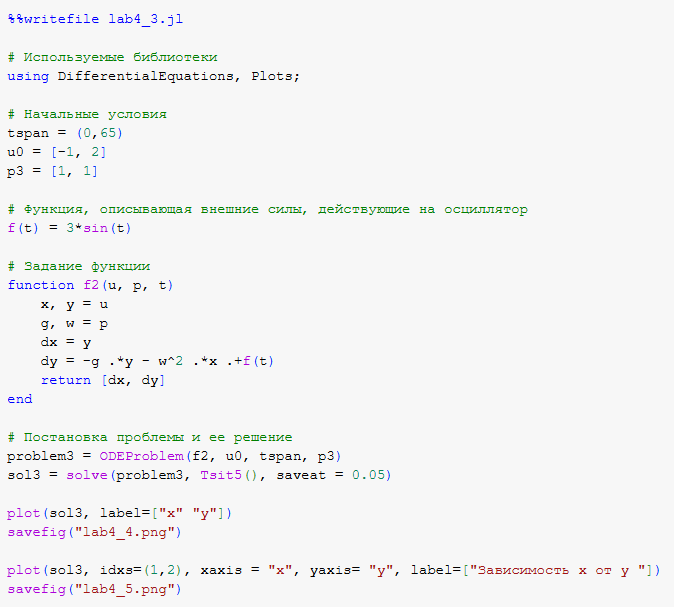{#fig:011 width=70%}

# Модель колебаний гармонического осциллятора c затуханием и под действием внешней силы

В результате получаем следующие графики решения уравнения гармонического осциллятора (рис. [-@fig:012]) и его фазового портрета (рис. [-@fig:013]).

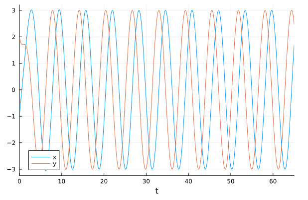{#fig:012 width=70%}

# Модель колебаний гармонического осциллятора c затуханием и под действием внешней силы

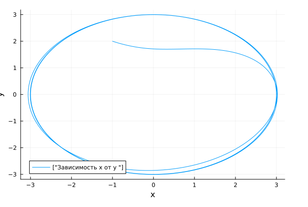{#fig:013 width=70%}

В этом случае сначала происходят колебания осциллятора, а затем график затухает, поскольку у нас есть параметр, отвечающий за потери энергии.

# Модель колебаний гармонического осциллятора c затуханием и под действием внешней силы

Теперь реализуем эту модель посредством OpenModelica.

model lab4_2
  parameter Real g = 10;
  parameter Real w = 11;
  parameter Real x0 = -1;
  parameter Real y0 = 2;
  Real x(start=x0);
  Real y(start=y0);
equation
    der(x) = y;
    der(y) = -g .*y - w^2 .*x;
end lab4_2;

# Модель колебаний гармонического осциллятора c затуханием и под действием внешней силы

В результате получаем следующие графики решения уравнения гармонического осциллятора (рис. [-@fig:014]) и его фазового портрета (рис. [-@fig:015]).

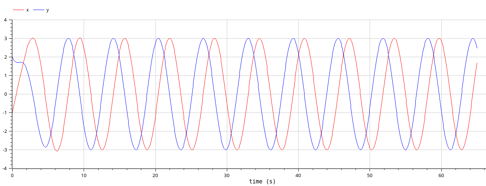{#fig:014 width=70%}

# Модель колебаний гармонического осциллятора c затуханием и под действием внешней силы

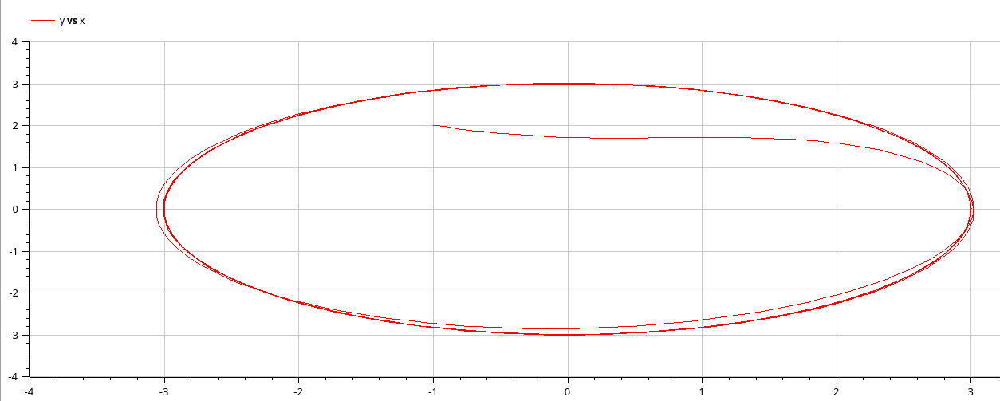{#fig:015 width=70%}

# Выводы

В процессе выполнения данной лабораторной работы я построила математическую модель гармонического осциллятора.