---
## Front matter
title: "Лабораторная работа №4"
subtitle: "Модель гармонических колебаний"
author: "Эспиноса Василита Кристина Микаела"

## Generic otions
lang: ru-RU
toc-title: "Содержание"

## Bibliography
bibliography: bib/cite.bib
csl: pandoc/csl/gost-r-7-0-5-2008-numeric.csl

## Pdf output format
toc: true # Table of contents
toc-depth: 2
lof: true # List of figures
lot: true # List of tables
fontsize: 12pt
linestretch: 1.5
papersize: a4
documentclass: scrreprt
## I18n polyglossia
polyglossia-lang:
  name: russian
  options:
	- spelling=modern
	- babelshorthands=true
polyglossia-otherlangs:
  name: english
## I18n babel
babel-lang: russian
babel-otherlangs: english
## Fonts
mainfont: IBM Plex Serif
romanfont: IBM Plex Serif
sansfont: IBM Plex Sans
monofont: IBM Plex Mono
mathfont: STIX Two Math
mainfontoptions: Ligatures=Common,Ligatures=TeX,Scale=0.94
romanfontoptions: Ligatures=Common,Ligatures=TeX,Scale=0.94
sansfontoptions: Ligatures=Common,Ligatures=TeX,Scale=MatchLowercase,Scale=0.94
monofontoptions: Scale=MatchLowercase,Scale=0.94,FakeStretch=0.9
mathfontoptions:
## Biblatex
biblatex: true
biblio-style: "gost-numeric"
biblatexoptions:
  - parentracker=true
  - backend=biber
  - hyperref=auto
  - language=auto
  - autolang=other*
  - citestyle=gost-numeric
## Pandoc-crossref LaTeX customization
figureTitle: "Рис."
tableTitle: "Таблица"
listingTitle: "Листинг"
lofTitle: "Список иллюстраций"
lotTitle: "Список таблиц"
lolTitle: "Листинги"
## Misc options
indent: true
header-includes:
  - \usepackage{indentfirst}
  - \usepackage{float} # keep figures where there are in the text
  - \floatplacement{figure}{H} # keep figures where there are in the text
---

# Цель работы

Построить математическую модель гармонического осциллятора на языке прогаммирования Julia и посредством ПО OpenModelica.

# Задание

Постройте фазовый портрет гармонического осциллятора и решение уравнения
гармонического осциллятора для следующих случаев

1. Колебания гармонического осциллятора без затуханий и без действий внешней
силы 

$\ddot{x} + 9.2x = 0$

2. Колебания гармонического осциллятора c затуханием и без действий внешней
силы

$\ddot{x} + 10\dot{x} + 11x = 0$

3. Колебания гармонического осциллятора c затуханием и под действием внешней
силы

$\ddot{x} + \dot{x} + x = 3\sin(t)$


# Теоретическое введение

Гармонические колебания — колебания, при которых физическая величина изменяется с течением времени по гармоническому (синусоидальному, косинусоидальному) закону.

Уравнение гармонического колебания имеет вид:

$$
x(t) = A \sin(\omega t + \varphi_0)
$$

или

$$
x(t) = A \cos(\omega t + \varphi_0),
$$

где:

- \( x \) — отклонение колеблющейся величины в текущий момент времени \( t \) от среднего за период значения (например, в кинематике — смещение, отклонение точки от положения равновесия);
- \( A \) — амплитуда колебания, то есть максимальное за период отклонение колеблющейся величины от среднего за период значения, размерность \( A \) совпадает с размерностью \( x \);
- \( \omega \) (рад/с, град/с) — циклическая частота, показывающая, на сколько радиан (градусов) изменяется фаза колебания за 1 секунду; 
- \( (\omega t + \varphi_0) = \varphi \) (рад, град) — полная фаза колебания (сокращённо — фаза, не путать с начальной фазой); 
- \( \varphi_0 \) (рад, град) — начальная фаза колебаний, которая определяет значение полной фазы колебания (и самой величины \( x \)) в момент времени \( t = 0 \).

Дифференциальное уравнение, описывающее гармонические колебания, имеет вид:

$$
\frac{d^2x}{dt^2} + \omega^2 x = 0.
$$

[@wiki_bash]

# Выполнение лабораторной работы 

## Модель колебаний гармонического осциллятора без затуханий и без действий внешней силы

Для начала реализуем эту модель на языке программирования Julia.

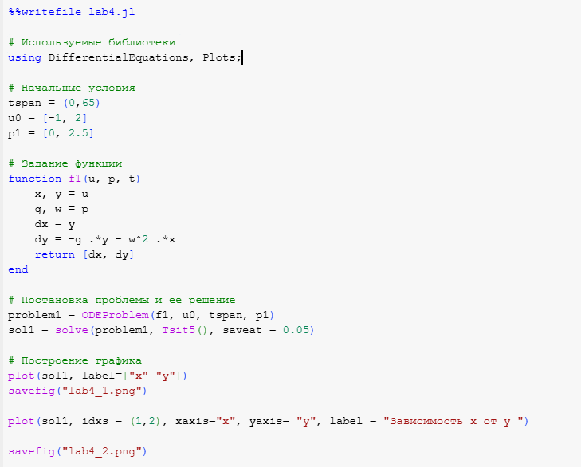{#fig:001 width=70%}

В результате получаем следующие графики решения уравнения гармонического осциллятора (рис. [-@fig:002]) и его фазового портрета (рис. [-@fig:003]).

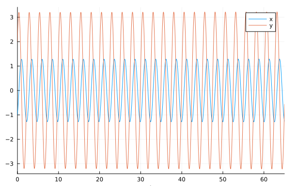{#fig:002 width=70%}

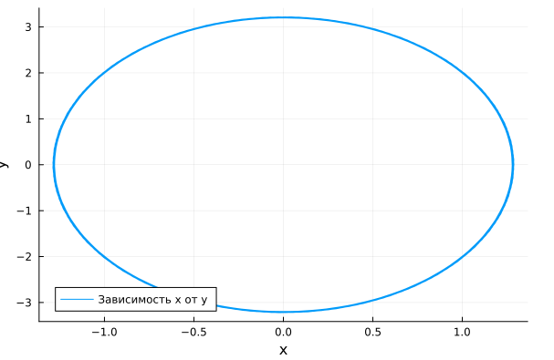{#fig:003 width=70%}

Можно заметить, что колебание осциллятора периодично, график не задухает.

Теперь реализуем эту модель посредством OpenModelica.

```modelica

model lab4_1

  parameter Real g = 0;
  parameter Real w = 2.5;
  parameter Real x0 = -1;
  parameter Real y0 = 2;
  Real x(start=x0);
  Real y(start=y0);
equation
    der(x) = y;
    der(y) = -g .*y - w^2 .*x;
end lab4_1;
```

В результате получаем следующие графики решения уравнения гармонического осциллятора (рис. [-@fig:004]) и его фазового портрета (рис. [-@fig:005]).

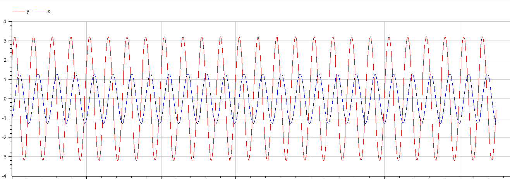{#fig:004 width=70%}

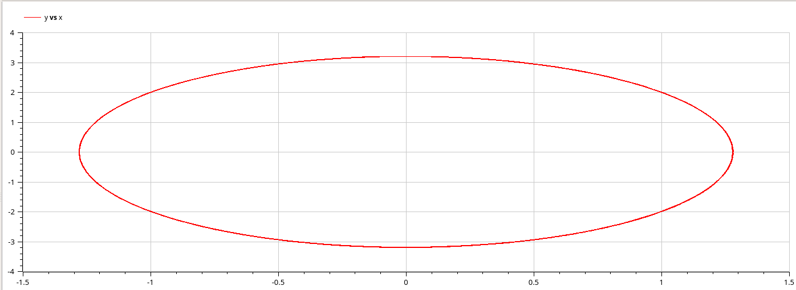{#fig:005 width=70%}

## Модель колебаний гармонического осциллятора c затуханием и без действий внешней силы

Pеализуем эту модель на языке программирования Julia.


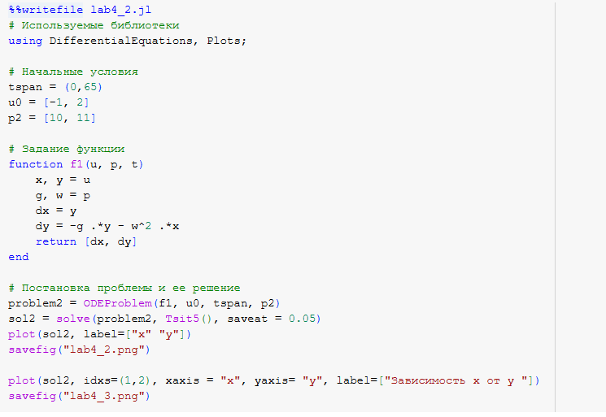{#fig:006 width=70%}

В результате получаем следующие графики решения уравнения гармонического осциллятора (рис. [-@fig:007]) и его фазового портрета (рис. [-@fig:008]).

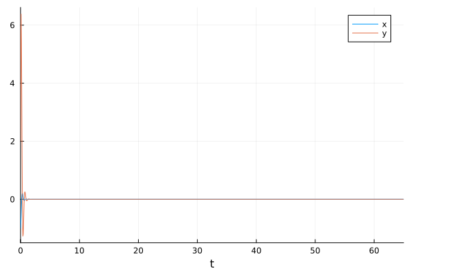{#fig:007 width=70%}

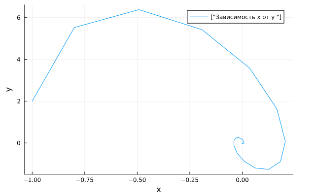{#fig:008 width=70%}

В этом случае сначала происходят колебания осциллятора, а затем график затухает, поскольку у нас есть параметр, отвечающий за потери энергии.

Теперь реализуем эту модель посредством OpenModelica.

```modelica
model lab4_2
  parameter Real g = 10;
  parameter Real w = 11;
  parameter Real x0 = -1;
  parameter Real y0 = 2;
  Real x(start=x0);
  Real y(start=y0);
equation
    der(x) = y;
    der(y) = -g .*y - w^2 .*x;
end lab4_2;
```

В результате получаем следующие графики решения уравнения гармонического осциллятора (рис. [-@fig:009]) и его фазового портрета (рис. [-@fig:010]).

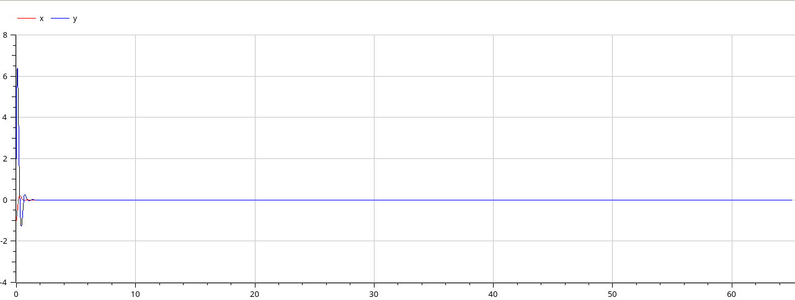{#fig:009 width=70%}

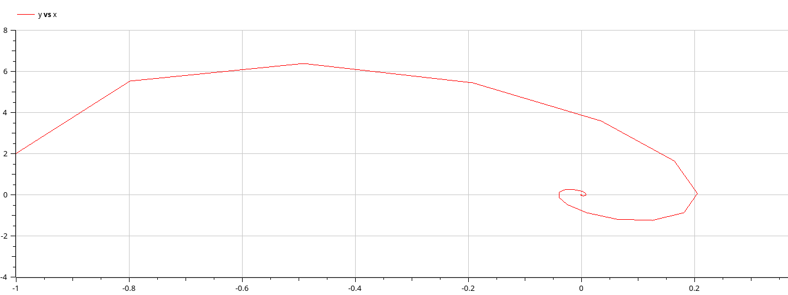{#fig:0010 width=70%}

## Модель колебаний гармонического осциллятора c затуханием и под действием внешней силы

Pеализуем эту модель на языке программирования Julia.


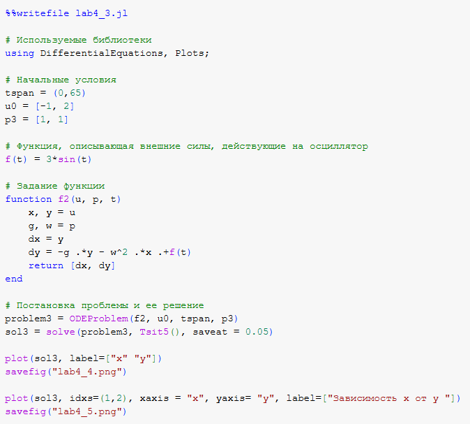{#fig:011 width=70%}

В результате получаем следующие графики решения уравнения гармонического осциллятора (рис. [-@fig:012]) и его фазового портрета (рис. [-@fig:013]).

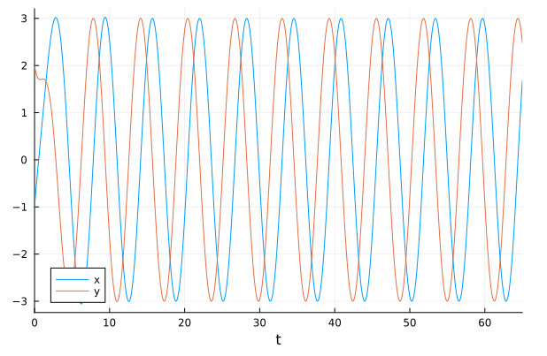{#fig:012 width=70%}

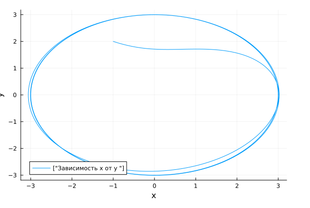{#fig:013 width=70%}

В этом случае сначала происходят колебания осциллятора, а затем график затухает, поскольку у нас есть параметр, отвечающий за потери энергии.

Теперь реализуем эту модель посредством OpenModelica.

```modelica
model lab4_2
  parameter Real g = 10;
  parameter Real w = 11;
  parameter Real x0 = -1;
  parameter Real y0 = 2;
  Real x(start=x0);
  Real y(start=y0);
equation
    der(x) = y;
    der(y) = -g .*y - w^2 .*x;
end lab4_2;
```

В результате получаем следующие графики решения уравнения гармонического осциллятора (рис. [-@fig:014]) и его фазового портрета (рис. [-@fig:015]).

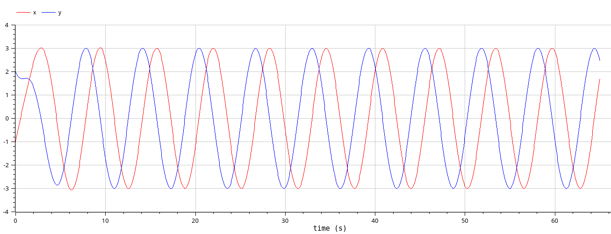{#fig:014 width=70%}

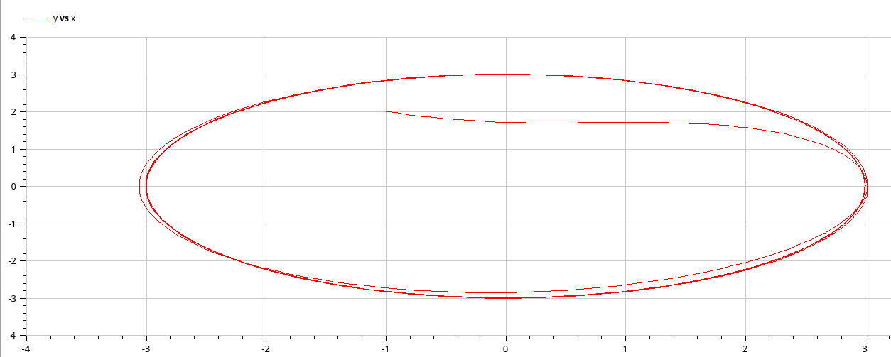{#fig:015 width=70%}


# Выводы

В процессе выполнения данной лабораторной работы я построила математическую модель гармонического осциллятора.

# Список литературы{.unnumbered}

::: {#refs}
:::
