---
## Front matter
lang: ru-RU
title: "Лабораторная работа №5"
subtitle: Модель Лотки-Вольтерры
author:
  - Эспиноса Василита К.М.
institute:
  - Российский университет дружбы народов, Москва, Россия

date: 19/04/2025

## i18n babel
babel-lang: russian
babel-otherlangs: english

## Formatting pdf
toc: false
toc-title: Содержание
slide_level: 2
aspectratio: 169
section-titles: true
theme: metropolis
header-includes:
 - \metroset{progressbar=frametitle,sectionpage=progressbar,numbering=fraction}
---

# Информация

## Докладчик

:::::::::::::: {.columns align=center}
::: {.column width="70%"}

  * Эспиноса Василита Кристина Микаела
  * студентка
  * Российский университет дружбы народов
  * [1032224624@pfur.ru](mailto:1032224624@pfur.ru)
  * <https://github.com/crisespinosa/>

:::
::: {.column width="30%"}

:::
::::::::::::::

# Цель работы

Построить математическую модель Лотки-Вольерры на языке прогаммирования Julia и посредством ПО OpenModelica.

# Задание

Для модели «хищник-жертва»:

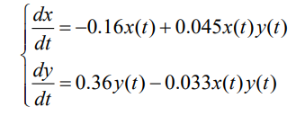{#fig:001 width=70%}

Постройте график зависимости численности хищников от численности жертв,
а также графики изменения численности хищников и численности жертв при
следующих начальных условиях: x0 =10, y0= 15   Найдите стационарное
состояние системы

# Теоретическое введение

Моде́ль Ло́тки — Вольте́рры (модель Ло́тки — Вольтерра́[1]) — модель взаимодействия двух видов типа «хищник — жертва», названная в честь своих авторов (Лотка, 1925; Вольтерра 1926), которые предложили модельные уравнения независимо друг от друга.

Такие уравнения можно использовать для моделирования систем «хищник — жертва», «паразит — хозяин», конкуренции и других видов взаимодействия между двумя видами[2].

В математической форме предложенная система имеет следующий вид:

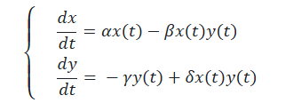{#fig:002 width=70%}

где 
- ( x ) — количество жертв,
- ( y ) — количество хищников,
- ( t ) — время,
- ( alpha, \beta, gamma, delta ) — коэффициенты, отражающие взаимодействия между видами

[@wiki]

# Выполнение лабораторной работы 

Для начала реализуем эту модель на языке программирования Julia.

Напишем код для решения системы ДУ, используя библиотеку DifferentialEquations.jl, а затем построим графики с помощью библиотеки Plots.

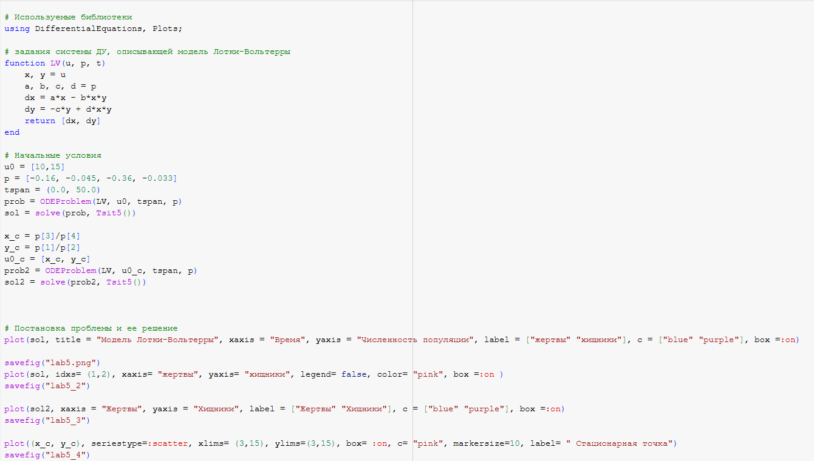{#fig:003 width=70%}

# Выполнение лабораторной работы 

В результате получаем следующие графики изменения численности хищников и численности жертв (рис. [-@fig:004]) и зависимости численности хищников от численности жертв (рис. [-@fig:005]).

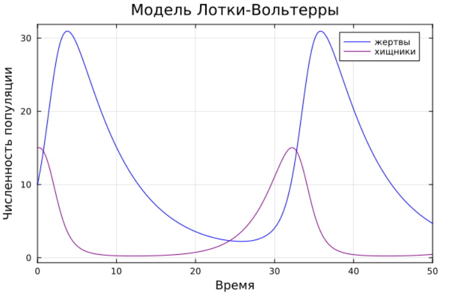{#fig:004 width=70%}

# Выполнение лабораторной работы 

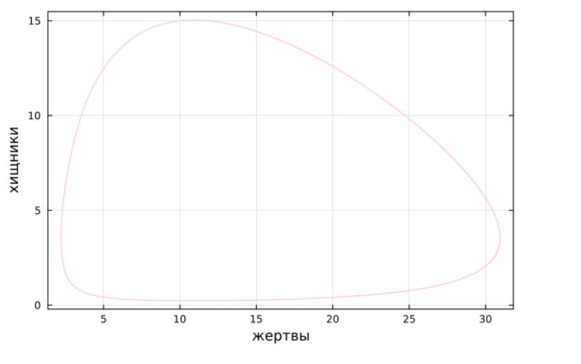{#fig:005 width=70%}

Графики периодичны, фазовый портрет замкнут, как и должно быть в жесткой модели Лотки-Вольтерры.

# Выполнение лабораторной работы 

Далее найдем стационарное состояние системы по формуле:

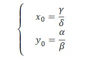{#fig:006 width=70%}

# Выполнение лабораторной работы 

Проверим, что эта точка действительно является стационарной, подставив ее в начальные условия.

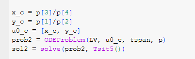{#fig:007 width=70%}

# Выполнение лабораторной работы 

Получим график из двух прямых, параллельных оси абсцисс, то есть численность и жертв, и хищников не меняется, как м должно быть в стационарном состоянии (рис. [-@fig:008])

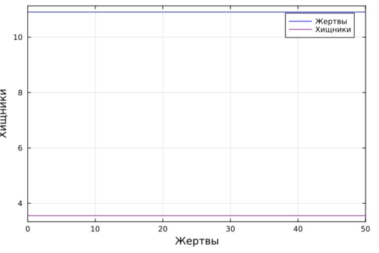{#fig:008 width=70%}

# Выполнение лабораторной работы 

Фазовый портрет в стационарном состоянии выглядит следующим образом (рис. [-@fig:009]).

{#fig:009 width=70%}

# Выполнение лабораторной работы 

Теперь реализуем эту модель посредством OpenModelica.

{#fig:010 width=70%}

# Выполнение лабораторной работы 

Выполним симуляцию на интервале от (0, 50), который брали для Julia и получим следующие графики изменения численности хищников и численности жертв 
(рис. [-@fig:011]) и зависимости численности хищников от численности жертв (рис. [-@fig:012]).

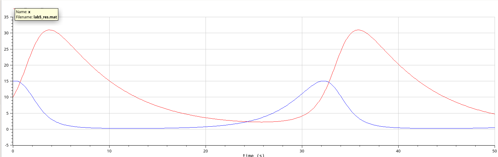{#fig:011 width=70%}

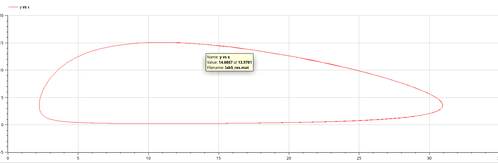{#fig:012 width=70%}

# Выполнение лабораторной работы 

Графики периодичны, фазовый портрет замкнут, как и должно быть в жесткой модели Лотки-Вольтерры.

# Выполнение лабораторной работы 

Также построим тут изменения численности хищников и численности жертв в стационарном состоянии.

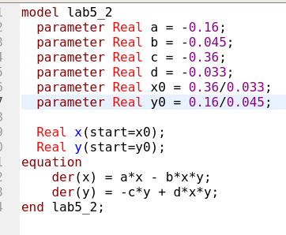{#fig:013 width=70%}

# Выполнение лабораторной работы 

Получим график, в котором численность жертв и хищников постоянна(рис. [-@fig:014]).

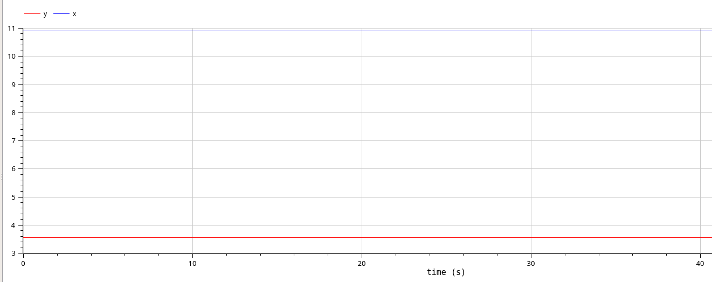{#fig:014 width=70%}

# Сравнение построения модели на Julia и в OpenModelica

Полученные графики идентичны.

# Выводы

В процессе выполнения данной лабораторной работы я построила математическую модель Лотки-Вольтерры на Julia и в OpenModelica.
