---
## Front matter
title: "Лабораторная работа №5"
subtitle: "Модель Лотки-Вольтерры"
author: "Эспиноса Василита Кристина Микаела"

## Generic otions
lang: ru-RU
toc-title: "Содержание"

## Bibliography
bibliography: bib/cite.bib
csl: pandoc/csl/gost-r-7-0-5-2008-numeric.csl

## Pdf output format
toc: true # Table of contents
toc-depth: 2
lof: true # List of figures
lot: true # List of tables
fontsize: 12pt
linestretch: 1.5
papersize: a4
documentclass: scrreprt
## I18n polyglossia
polyglossia-lang:
  name: russian
  options:
	- spelling=modern
	- babelshorthands=true
polyglossia-otherlangs:
  name: english
## I18n babel
babel-lang: russian
babel-otherlangs: english
## Fonts
mainfont: IBM Plex Serif
romanfont: IBM Plex Serif
sansfont: IBM Plex Sans
monofont: IBM Plex Mono
mathfont: STIX Two Math
mainfontoptions: Ligatures=Common,Ligatures=TeX,Scale=0.94
romanfontoptions: Ligatures=Common,Ligatures=TeX,Scale=0.94
sansfontoptions: Ligatures=Common,Ligatures=TeX,Scale=MatchLowercase,Scale=0.94
monofontoptions: Scale=MatchLowercase,Scale=0.94,FakeStretch=0.9
mathfontoptions:
## Biblatex
biblatex: true
biblio-style: "gost-numeric"
biblatexoptions:
  - parentracker=true
  - backend=biber
  - hyperref=auto
  - language=auto
  - autolang=other*
  - citestyle=gost-numeric
## Pandoc-crossref LaTeX customization
figureTitle: "Рис."
tableTitle: "Таблица"
listingTitle: "Листинг"
lofTitle: "Список иллюстраций"
lotTitle: "Список таблиц"
lolTitle: "Листинги"
## Misc options
indent: true
header-includes:
  - \usepackage{indentfirst}
  - \usepackage{float} # keep figures where there are in the text
  - \floatplacement{figure}{H} # keep figures where there are in the text
---

# Цель работы

Построить математическую модель Лотки-Вольерры на языке прогаммирования Julia и посредством ПО OpenModelica.

# Задание

Для модели «хищник-жертва»:

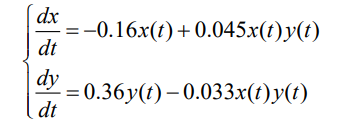{#fig:001 width=70%}

Постройте график зависимости численности хищников от численности жертв,
а также графики изменения численности хищников и численности жертв при
следующих начальных условиях: x0 =10, y0= 15   Найдите стационарное
состояние системы

# Теоретическое введение

Моде́ль Ло́тки — Вольте́рры (модель Ло́тки — Вольтерра́[1]) — модель взаимодействия двух видов типа «хищник — жертва», названная в честь своих авторов (Лотка, 1925; Вольтерра 1926), которые предложили модельные уравнения независимо друг от друга.

Такие уравнения можно использовать для моделирования систем «хищник — жертва», «паразит — хозяин», конкуренции и других видов взаимодействия между двумя видами[2].

В математической форме предложенная система имеет следующий вид:

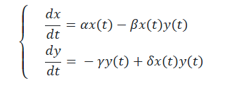{#fig:002 width=70%}

где 
- ( x ) — количество жертв,
- ( y ) — количество хищников,
- ( t ) — время,
- ( alpha, \beta, gamma, delta ) — коэффициенты, отражающие взаимодействия между видами

[@wiki]

# Выполнение лабораторной работы 

Для начала реализуем эту модель на языке программирования Julia.

Напишем код для решения системы ДУ, используя библиотеку DifferentialEquations.jl, а затем построим графики с помощью библиотеки Plots.

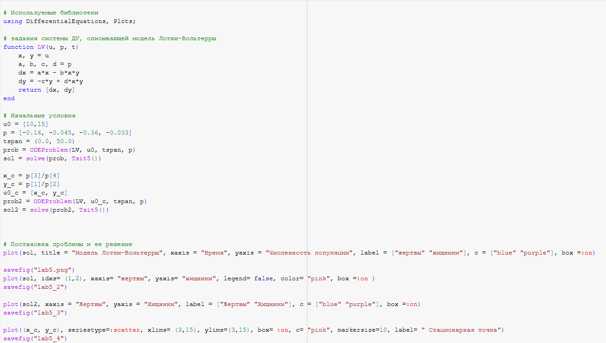{#fig:003 width=70%}

В результате получаем следующие графики изменения численности хищников и численности жертв (рис. [-@fig:004]) и зависимости численности хищников от численности жертв (рис. [-@fig:005]).

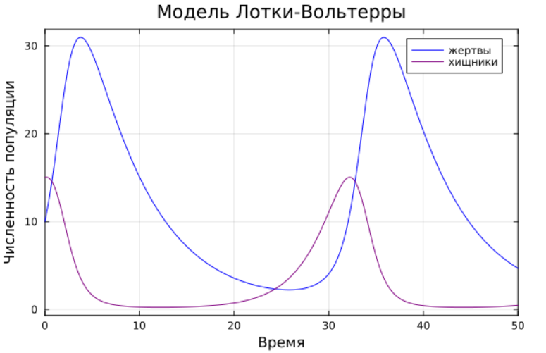{#fig:004 width=70%}

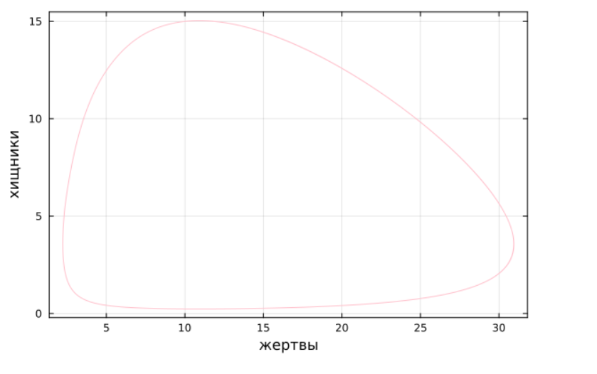{#fig:005 width=70%}

Графики периодичны, фазовый портрет замкнут, как и должно быть в жесткой модели Лотки-Вольтерры.

Далее найдем стационарное состояние системы по формуле:

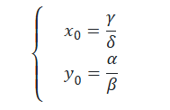{#fig:006 width=70%}

Проверим, что эта точка действительно является стационарной, подставив ее в начальные условия.

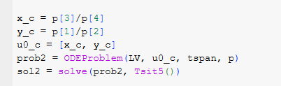{#fig:007 width=70%}

Получим график из двух прямых, параллельных оси абсцисс, то есть численность и жертв, и хищников не меняется, как м должно быть в стационарном состоянии (рис. [-@fig:008])

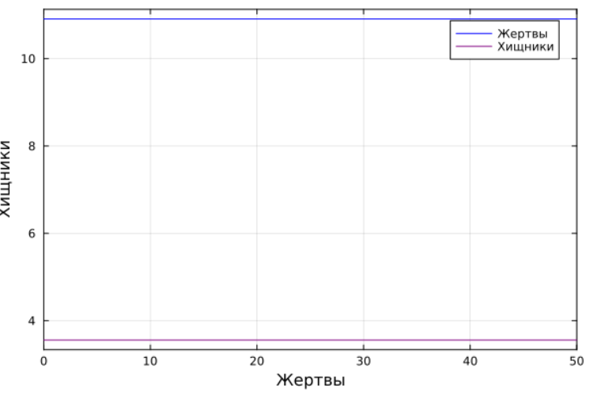{#fig:008 width=70%}

Фазовый портрет в стационарном состоянии выглядит следующим образом (рис. [-@fig:009]).

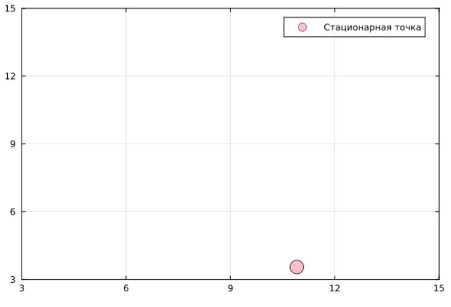{#fig:009 width=70%}

Теперь реализуем эту модель посредством OpenModelica.

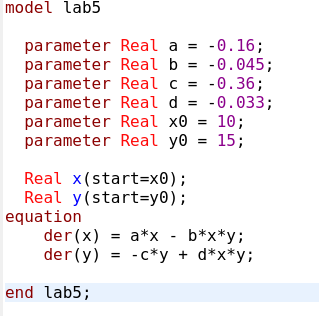{#fig:010 width=70%}

Выполним симуляцию на интервале от (0, 50), который брали для Julia и получим следующие графики изменения численности хищников и численности жертв 
(рис. [-@fig:011]) и зависимости численности хищников от численности жертв (рис. [-@fig:012]).

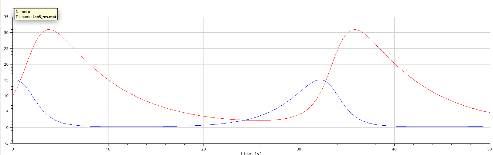{#fig:011 width=70%}

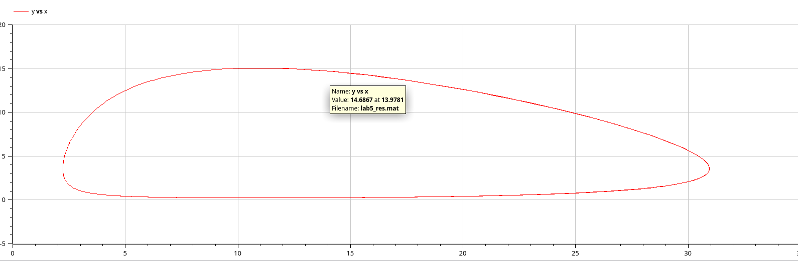{#fig:012 width=70%}

Графики периодичны, фазовый портрет замкнут, как и должно быть в жесткой модели Лотки-Вольтерры.

Также построим тут изменения численности хищников и численности жертв в стационарном состоянии.

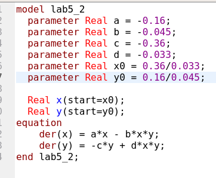{#fig:013 width=70%}

Получим график, в котором численность жертв и хищников постоянна(рис. [-@fig:014]).

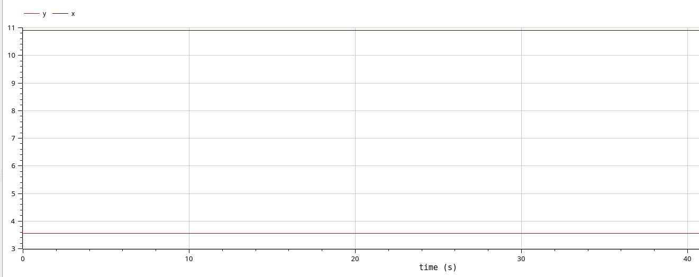{#fig:014 width=70%}

# Сравнение построения модели на Julia и в OpenModelica

Полученные графики идентичны.

# Выводы

В процессе выполнения данной лабораторной работы я построила математическую модель Лотки-Вольтерры на Julia и в OpenModelica.

# Список литературы{.unnumbered}

::: {#refs}
:::
