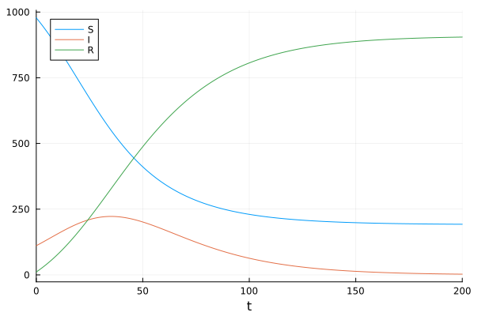
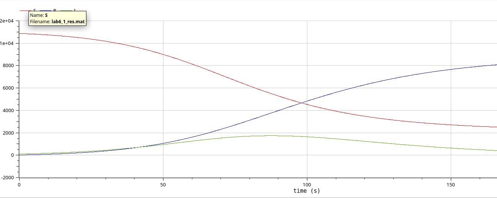
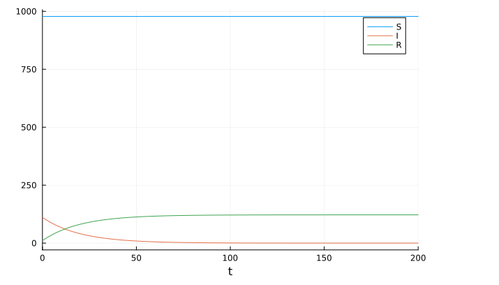
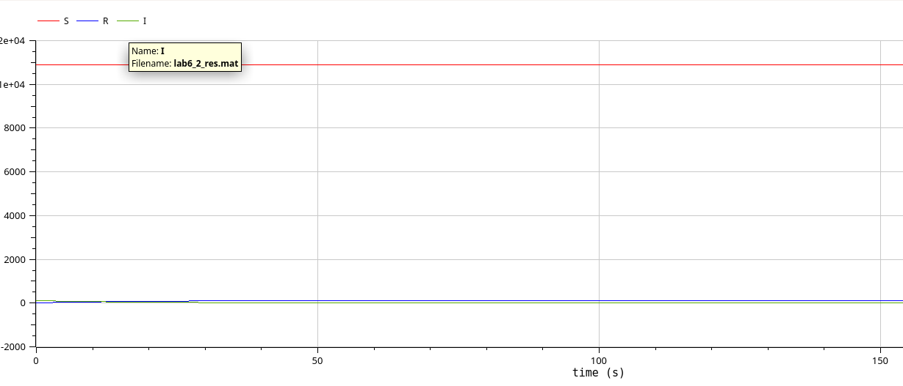

---
## Front matter
title: " Лабораторная работа 6"
subtitle: "Задача об эпидемии"
author: "Эспиноса Василита К.М"

## Generic otions
lang: ru-RU
toc-title: "Содержание"

## Bibliography
bibliography: bib/cite.bib
csl: pandoc/csl/gost-r-7-0-5-2008-numeric.csl

## Pdf output format
toc: true # Table of contents
toc-depth: 2
lof: true # List of figures
lot: true # List of tables
fontsize: 12pt
linestretch: 1.5
papersize: a4
documentclass: scrreprt
## I18n polyglossia
polyglossia-lang:
  name: russian
  options:
	- spelling=modern
	- babelshorthands=true
polyglossia-otherlangs:
  name: english
## I18n babel
babel-lang: russian
babel-otherlangs: english
## Fonts
mainfont: IBM Plex Serif
romanfont: IBM Plex Serif
sansfont: IBM Plex Sans
monofont: IBM Plex Mono
mathfont: STIX Two Math
mainfontoptions: Ligatures=Common,Ligatures=TeX,Scale=0.94
romanfontoptions: Ligatures=Common,Ligatures=TeX,Scale=0.94
sansfontoptions: Ligatures=Common,Ligatures=TeX,Scale=MatchLowercase,Scale=0.94
monofontoptions: Scale=MatchLowercase,Scale=0.94,FakeStretch=0.9
mathfontoptions:
## Biblatex
biblatex: true
biblio-style: "gost-numeric"
biblatexoptions:
  - parentracker=true
  - backend=biber
  - hyperref=auto
  - language=auto
  - autolang=other*
  - citestyle=gost-numeric
## Pandoc-crossref LaTeX customization
figureTitle: "Рис."
tableTitle: "Таблица"
listingTitle: "Листинг"
lofTitle: "Список иллюстраций"
lotTitle: "Список таблиц"
lolTitle: "Листинги"
## Misc options
indent: true
header-includes:
  - \usepackage{indentfirst}
  - \usepackage{float} # keep figures where there are in the text
  - \floatplacement{figure}{H} # keep figures where there are in the text
---

# Цель работы

Исследовать модель SIR (задача об эпидемии)

# Задание

**Вариант 5**

На одном острове вспыхнула эпидемия. Известно, что из всех проживающих
на острове (N=11 000) в момент начала эпидемии (t=0) число заболевших людей
(являющихся распространителями инфекции) I(0)=111, А число здоровых людей с
иммунитетом к болезни R(0)=11. Таким образом, число людей восприимчивых к
болезни, но пока здоровых, в начальный момент времени S(0)=N-I(0)- R(0).
Постройте графики изменения числа особей в каждой из трех групп.
Рассмотрите, как будет протекать эпидемия в случае:

1) если \( I(0) \leq I^* \)

2) если \( I(0) > I^* \)

# Теоретическое введение

Компартментальные модели являются очень общим методом моделирования. Они часто применяются к математическому моделированию инфекционных заболеваний. Население распределяется по отделениям с помощью меток – например, S, I, или R, (Susceptible, Infectious, or Recovered). Люди могут прогресс между отсеками. 
Порядок расположения меток обычно показывает структуру потоков между компартментами; например, SEIS означает восприимчивый, подверженный воздействию, инфекционный, затем снова восприимчивый[@wiki_sir].

Зарождение таких моделей относится к началу 20 века, важными работами которого являются работы Росса в 1916 году Росс и Хадсон в 1917 году, Кермак и Маккендрик в 1927 г., и Кендалл в 1956 году. 
Модель Рид–Мороз также был важным и широко упускаемым из виду предком современных подходов к эпидемиологическому моделированию.

Модели чаще всего управляются с помощью обыкновенных дифференциальных уравнений (которые являются детерминированными), но также могут использоваться со стохастической (случайной) структурой, которая более реалистична, но гораздо сложнее в анализе.

Модели пытаются предсказать такие вещи, как распространение болезни, или общее число инфицированных, или продолжительность эпидемии, а также оценить различные эпидемиологические параметры, такие как репродуктивное число. Такие модели могут показать, насколько различаются вмешательства общественного здравоохранения могут повлиять на исход эпидемии, например, на то, какой метод является наиболее эффективным для выпуска ограниченного количества вакцин в данной популяции.


# Выполнение лабораторной работы

### Случай \( I(0) \leq I^* \)

***

Рассмотрим случай, когда число заболевших невелико, и инфекция может распространяться в популяции, так как меры изоляции ещё не введены. Используется обычная модель SIR с заражением.

#### Реализация на Julia

Зададим систему дифференциальных уравнений, описывающих нашу модель, а также начальные условия данные в задаче.

```
function sir(u,p,t)
    (S,I,R) = u
    (b, c) = p
    N = S+I+R
    dS = -(b*S*I)/N
    dI = (b*I*S)/N - c*I
    dR = c*I
    return [dS, dI, dR]
end

```

```
N = 1100
I_0 = 111
R_0 = 11
S_0 = N - I_0 - R_0
u0 = [S_0, I_0, R_0]
p = [0.1, 0.05]
tspan = (0.0, 200.0)

```

Используя библиотеки `DifferentialEquations.jl` и `Plots.jl` решим систему дифференциальных уравнений и построим соответствующий график.

```
prob2 = ODEProblem(sir_2, u0, tspan, p)
sol2 = solve(prob2, Tsit5(), saveat = 0.1)
plot(sol2, label = ["S" "I" "R"])

```

В результате получаем следующий график динамики изменения числа людей в каждой из трех групп (рис. [-@fig:001]). В этом случае предполагается, что инфицированные не изолированы и могут свободно взаимодействовать с восприимчивыми, передавая им инфекцию.
На соответствующем графике (рис. [-@fig:001]) видна типичная эпидемиологическая динамика: численность восприимчивых \( S \) постепенно уменьшается по мере заражения, а численность инфицированных \( I \) сначала увеличивается, достигая пика, а затем убывает — по мере выздоровления и снижения числа восприимчивых. 
Число выздоровевших \( R \) стабильно растёт, поскольку с течением времени всё больше людей преодолевают болезнь и приобретают иммунитет. В конечном итоге инфекция затухает, и система достигает устойчивого состояния, при котором большинство населения становится невосприимчивым.

{#fig:001 width=70%}

#### Реализация на OpenModelica

На этом этапе мы определяем параметры, начальные значения и систему дифференциальных уравнений, а затем проводим моделирование на том же временном интервале и с тем же шагом, что и в среде Julia.

```
model lab6_1

  parameter Real I_0 = 111;
  parameter Real R_0 = 11;
  parameter Real S_0 = 10878;
  parameter Real N = 11000;
  parameter Real b = 0.1;
  parameter Real c = 0.05;
  
  Real S(start=S_0);
  Real I(start=I_0);
  Real R(start=R_0);
  
equation
  der(S) = -(b*S*I)/N;
  der(I) = (b*I*S)/N - c*I;
  der(R) = c*I;

end lab6_1;
```

В результате получаем следующий график динамики изменения числа людей в каждой из трех групп (рис. [-@fig:002]). В этом случае предполагается, что инфицированные не изолированы и могут свободно взаимодействовать с восприимчивыми, передавая им инфекцию.
На соответствующем графике (рис. [-@fig:002]) видна типичная эпидемиологическая динамика: численность восприимчивых \( S \) постепенно уменьшается по мере заражения, а численность инфицированных \( I \) сначала увеличивается, достигая пика, а затем убывает — по мере выздоровления и снижения числа восприимчивых. 
Число выздоровевших \( R \) стабильно растёт, поскольку с течением времени всё больше людей преодолевают болезнь и приобретают иммунитет. В конечном итоге инфекция затухает, и система достигает устойчивого состояния, при котором большинство населения становится невосприимчивым.

{#fig:002 width=70%}


### Случай \( I(0) > I^* \)

***

Рассмотрим случай, когда число заболевших не превышает критического значения \( I^* \), 
то есть считаем, что все больные изолированы и не заражают здоровых.


#### Реализация на Julia

Зададим систему дифференциальных уравнений, описывающих нашу модель, а также начальные условия данные в задаче.

```

function sir_2(u,p,t)
    (S,I,R) = u
    (b, c) = p
    N = S+I+R
    dS = 0
    dI = -c*I
    dR = c*I
    return [dS, dI, dR]
end

N = 1100
I_0 = 111
R_0 = 11
S_0 = N - I_0 - R_0
u0 = [S_0, I_0, R_0]
p = [0.1, 0.05]
tspan = (0.0, 200.0)

```

Используя библиотеки `DifferentialEquations.jl` и `Plots.jl` решим систему дифференциальных уравнений и построим соответствующий график.

```
prob_2 = ODEProblem(sir_2, u0, tspan, p)
sol_2 = solve(prob_2, Tsit5(), saveat = 0.1)
plot(sol, label = ["S" "I" "R"])

```

В результате получаем следующий график динамики изменения числа людей в каждой из трех групп (рис. [-@fig:003]). Видно, что численность здоровых (восприимчивых) людей \( S \) остаётся постоянной, поскольку рассматривается случай, при котором все инфицированные изолированы и не заражают остальных. 

Число заболевших \( I \) экспоненциально убывает, так как новые случаи не появляются, а выздоровление продолжается. Соответственно, численность людей с иммунитетом \( R \) монотонно возрастает и в конечном итоге стабилизируется, достигая значения, равного начальному числу заболевших.

{#fig:003 width=70%}

#### Реализация на OpenModelica

На этом этапе мы определяем параметры, начальные значения и систему дифференциальных уравнений, а затем проводим моделирование на том же временном интервале и с тем же шагом, что и в среде Julia.

```

model lab6_2

  parameter Real I_0 = 111;
  parameter Real R_0 = 11;
  parameter Real S_0 = 10878;
  parameter Real N = 11000;
  parameter Real b = 0.1;
  parameter Real c = 0.05;

  Real S(start=S_0);
  Real I(start=I_0);
  Real R(start=R_0);
  
equation
  der(S) = 0;
  der(I) = - c*I;
  der(R) = c*I;

end lab6_2;

```

В результате получаем следующий график динамики изменения числа людей в каждой из трех групп (рис. [-@fig:004]). Видно, что численность здоровых (восприимчивых) людей \( S \) остаётся постоянной, поскольку рассматривается случай, при котором все инфицированные изолированы и не заражают остальных. 

Число заболевших \( I \) экспоненциально убывает, так как новые случаи не появляются, а выздоровление продолжается. Соответственно, численность людей с иммунитетом \( R \) монотонно возрастает и в конечном итоге стабилизируется, достигая значения, равного начальному числу заболевших.

{#fig:004 width=70%}


# Выводы

В результате выполнения данной лабораторной работы я исследовала модель SIR.

# Список литературы{.unnumbered}

::: {#refs}
:::
