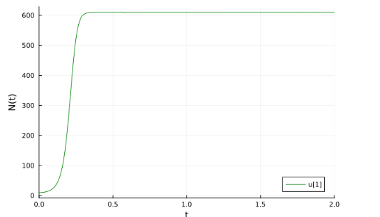

---
## Front matter
lang: ru-RU
title: " Лабораторная работа 7"
subtitle: "Эффективность рекламы"
author:
  - Эспиноса Василита К.М.
institute:
  - Российский университет дружбы народов, Москва, Россия

date: 17/05/2025

## i18n babel
babel-lang: russian
babel-otherlangs: english

## Formatting pdf
toc: false
toc-title: Содержание
slide_level: 2
aspectratio: 169
section-titles: true
theme: metropolis
header-includes:
 - \metroset{progressbar=frametitle,sectionpage=progressbar,numbering=fraction}
---

# Информация

## Докладчик

:::::::::::::: {.columns align=center}
::: {.column width="70%"}

* Эспиноса Василита Кристина Микаела  
* студентка  
* Российский университет дружбы народов  
* [1032224624@pfur.ru](mailto:1032224624@pfur.ru)  
* <https://github.com/crisespinosa/>

:::
::: {.column width="30%"}

:::
::::::::::::::

# Цель работы

Исследовать модель эффективности рекламы.

# Задание

Построить график распространения рекламы, математическая модель которой описывается следующим уравнением:

{#fig:001 width=70%}

При этом объем аудитории N= 610, в начальный момент о товаре знает 10 человек. Для случая 2 определить в какой момент времени скорость распространения рекламы будет иметь максимальное значение.

# Выполнение лабораторной работы

# Реализация на Julia

```
f(n, p, t) = (p[1] + p[2]*n)*(p[3] - n)
p1 = [0.77, 0.00017, 610]
p2 = [0.000055, 0.29, 610]
n_0 = 10
tspan1 = (0.0, 14.0)
tspan2 = (0.0, 0.05)
prob1 = ODEProblem(f, n_0, tspan1, p1)
sol1 = solve(prob1, Tsit5(), saveat = 0.01)
plot(sol1, markersize = 15, c = :green, yaxis = "N(t)")
savefig("sol1_plot1.png")

```
# Реализация на Julia

{#fig:001 width=70%}

# Реализация на Julia

Теперь решим ДУ для второго случая и построим график.

```
prob2 = ODEProblem(f, n_0, tspan2, p2)
sol2 = solve(prob2, Tsit5(), saveat = 0.0001)
plot(sol2, markersize = 15, c = :green, yaxis = "N(t)")

```
# Реализация на Julia

```
dev = [sol2(i, Val{1}) for i in 0:0.0001:0.05]
```

Получим значение `26980.63240438858`

# Реализация на Julia

```
idx = findall(x -> x == 26980.63240438858, dev)

```
Получим `[233]`

# Реализация на Julia

```
x = sol2.t[233]
y = sol2.u[233]
scatter!((x, y), c = :purple, legend = :bottomright)

```
# Реализация на Julia

Получаем график, который является логистической кривой α1 << α2

{#fig:002 width=70%}

# Реализация на Julia

```
function f3(u, p, t)
    n = u
    return (0.5 * t + 0.3 * t * n) * (610 - n)
end

u_0 = 10
tspan = (0.0, 2)
prob = ODEProblem(f3, u_0, tspan)
sol = solve(prob, Tsit5(), saveat = 0.001)
plot(sol, markersize = 15, c = :green, yaxis = "N(t)")

```
# Реализация на Julia

В результате получаем следующий график (рис. [-@fig:003]).

{#fig:003 width=70%}

# Реализация на OpenModelica

**1**

```
  parameter Real a_1 = 0.77;
  parameter Real a_2 = 0.00017;
  parameter Real N = 610;
  parameter Real n_0 = 10;

  Real n(start = n_0);

equation
  der(n) = (a_1 + a_2 * n) * (N - n);
```
# Реализация на OpenModelica

{#fig:004 width=70%}

# Реализация на OpenModelica

**2**

```

  parameter Real a_1 = 0.000055;
  parameter Real a_2 = 0.29;
  parameter Real N = 610;
  parameter Real n_0 = 10;

  Real n(start = n_0);

equation
  der(n) = (a_1 + a_2 * n) * (N - n);

```

# Реализация на OpenModelica

{#fig:005 width=70%}

# Реализация на OpenModelica

{#fig:006 width=70%}

**3**

```
  parameter Real a_1 = 0.5;
  parameter Real a_2 = 0.3;
  parameter Real N = 610;
  parameter Real n_0 = 10;

  Real n(start = n_0);

equation
  der(n) = (a_1 * time + a_2 * time * n) * (N - n); 

```
# Реализация на OpenModelica)

{#fig:007 width=70%}


# Выводы

В результате выполнения данной лабораторной работы была исследована модель эффективности рекламы.


