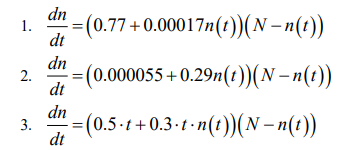
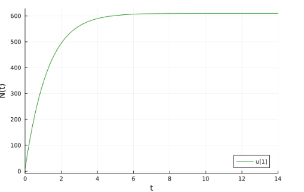
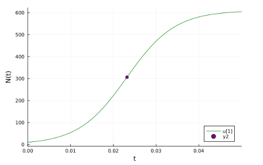
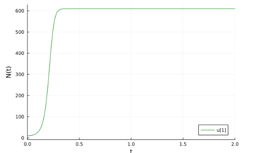
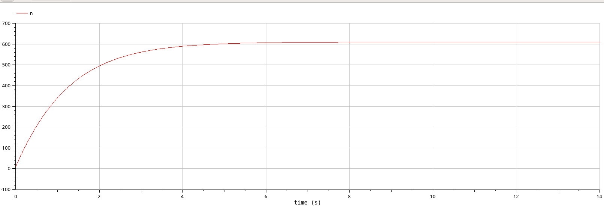
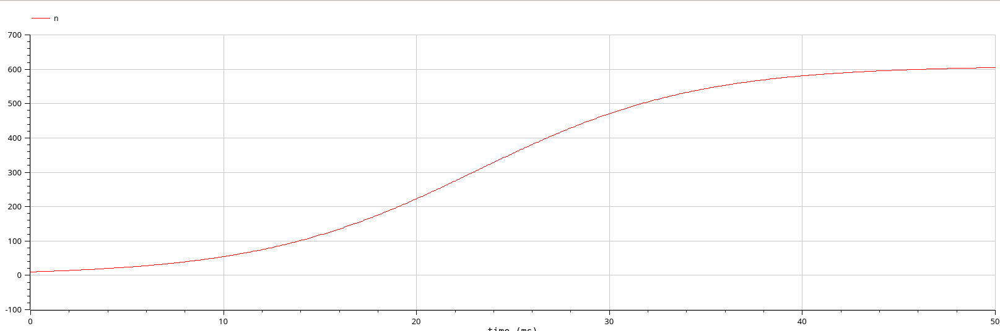
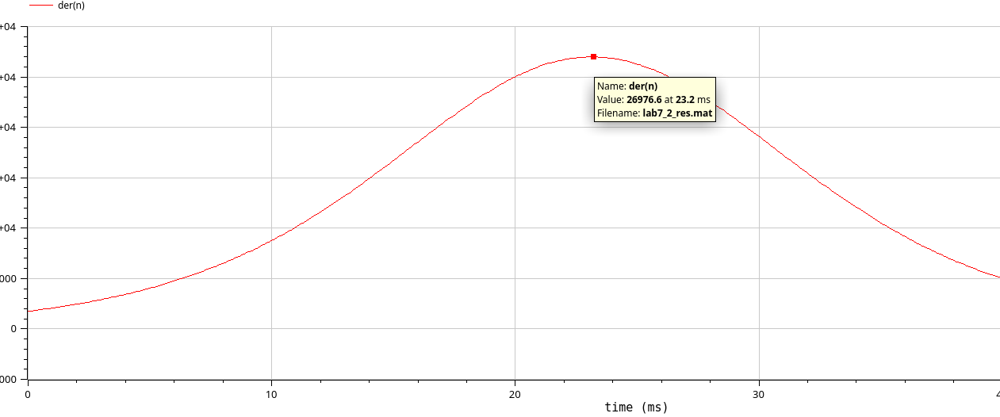
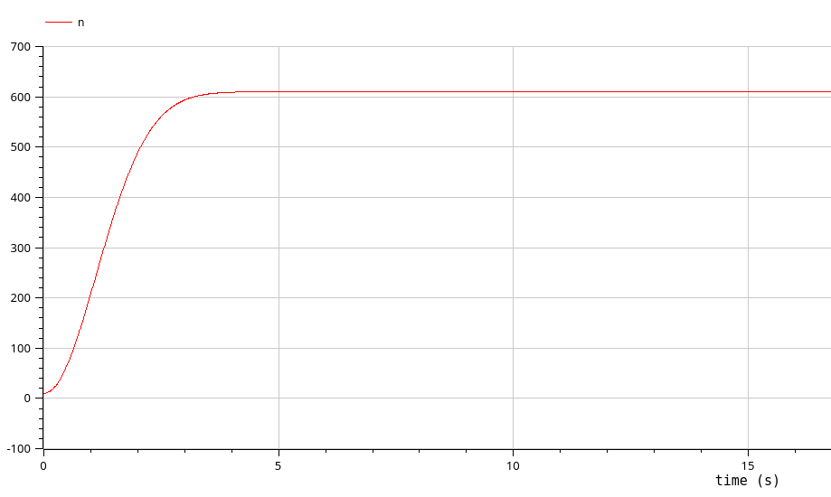

---
## Front matter
title: "Лабораторная работа №7"
subtitle: "Эффективность рекламы"
author: "Эспиноса Василита Кристина Микаела"

## Generic otions
lang: ru-RU
toc-title: "Содержание"

## Bibliography
bibliography: bib/cite.bib
csl: pandoc/csl/gost-r-7-0-5-2008-numeric.csl

## Pdf output format
toc: true # Table of contents
toc-depth: 2
lof: true # List of figures
lot: true # List of tables
fontsize: 12pt
linestretch: 1.5
papersize: a4
documentclass: scrreprt
## I18n polyglossia
polyglossia-lang:
  name: russian
  options:
	- spelling=modern
	- babelshorthands=true
polyglossia-otherlangs:
  name: english
## I18n babel
babel-lang: russian
babel-otherlangs: english
## Fonts
mainfont: IBM Plex Serif
romanfont: IBM Plex Serif
sansfont: IBM Plex Sans
monofont: IBM Plex Mono
mathfont: STIX Two Math
mainfontoptions: Ligatures=Common,Ligatures=TeX,Scale=0.94
romanfontoptions: Ligatures=Common,Ligatures=TeX,Scale=0.94
sansfontoptions: Ligatures=Common,Ligatures=TeX,Scale=MatchLowercase,Scale=0.94
monofontoptions: Scale=MatchLowercase,Scale=0.94,FakeStretch=0.9
mathfontoptions:
## Biblatex
biblatex: true
biblio-style: "gost-numeric"
biblatexoptions:
  - parentracker=true
  - backend=biber
  - hyperref=auto
  - language=auto
  - autolang=other*
  - citestyle=gost-numeric
## Pandoc-crossref LaTeX customization
figureTitle: "Рис."
tableTitle: "Таблица"
listingTitle: "Листинг"
lofTitle: "Список иллюстраций"
lotTitle: "Список таблиц"
lolTitle: "Листинги"
## Misc options
indent: true
header-includes:
  - \usepackage{indentfirst}
  - \usepackage{float} # keep figures where there are in the text
  - \floatplacement{figure}{H} # keep figures where there are in the text
---

# Цель работы

Исследовать модель эффективности рекламы.

# Задание

Построить график распространения рекламы, математическая модель которой описывается следующим уравнением:

{#fig:001 width=70%}

При этом объем аудитории N= 610, в начальный момент о товаре знает 10 человек. Для случая 2 определить в какой момент времени скорость распространения рекламы будет иметь максимальное значение.

# Теоретическое введение

Пусть некая фирма начинает рекламировать новый товар. Необходимо, чтобы прибыль от будущих продаж покрывала издержки на дорогостоящую кампанию. Ясно, что вначале расходы могут превышать прибыль, поскольку лишь малая часть потенциальных покупателей будет информирована о новом товаре. Затем, при увеличении числа продаж, уже возможно рассчитывать на заметную прибыль, и, наконец, наступит момент, когда рынок насытится, и рекламировать товар далее станет бессмысленно.

Модель рекламной кампании основывается на следующих основных предположениях. Считается, что величина 
\[
\frac{dN}{dt}
\] 
— скорость изменения со временем числа потребителей, узнавших о товаре и готовых купить его (\(t\) — время, прошедшее с начала рекламной кампании, \(N(t)\) – число уже информированных клиентов), — пропорциональна числу покупателей, еще не знающих о нем, т. е. величине  
\[
\alpha_1(t)(N_0 - N(t)),
\] 
где \(N_0\) — общее число покупателей (емкость рынка), \(\alpha_1(t)\) характеризует интенсивность рекламной кампании. Предполагается также, что узнавшие о товаре потребители распространяют полученную информацию среди неосведомленных, выступая как бы в роли дополнительных рекламных агентов фирмы. Их вклад равен величине  
\[
\alpha_2(t)N(t)(N_0 - N(t)),
\] 
которая тем больше, чем больше число агентов. Величина \(\alpha_2\) характеризует степень общения покупателей между собой [@stud].

В итоге получаем уравнение: 
\[
\frac{dn}{dt} = (\alpha_1 + \alpha_2 n(t))(N - n(t))
\]
# Выполнение лабораторной работы

## Реализация на Julia

Подключаем нужные библиотеки для решения ДУ и для отрисовки графиков. Задаем само дифференциальное уравнение, а также начальные условия и параметры. Определяем ODEProblem.

```
f(n, p, t) = (p[1] + p[2]*n)*(p[3] - n)
p1 = [0.77, 0.00017, 610]
p2 = [0.000055, 0.29, 610]
n_0 = 10
tspan1 = (0.0, 14.0)
tspan2 = (0.0, 0.05)
prob1 = ODEProblem(f, n_0, tspan1, p1)
```
Когда задача определена, можем ее решить методом solve() и нарисовать график с помощью plot().

```
sol1 = solve(prob1, Tsit5(), saveat = 0.01)
plot(sol1, markersize = 15, c = :green, yaxis = "N(t)")
savefig("sol1_plot1.png")

```
В результате получаем следующий график (рис. [-@fig:001]), (α1 >> α2)мы получили модель Мальтуса. Kривая становится почти горизонтальной c t=6 


{#fig:001 width=70%}


Теперь решим ДУ для второго случая и построим график.

```
prob2 = ODEProblem(f, n_0, tspan2, p2)
sol2 = solve(prob2, Tsit5(), saveat = 0.0001)
plot(sol2, markersize = 15, c = :green, yaxis = "N(t)")

```

С помощью команды maximum() найдем максимальный элемент из этого вектора:

```
dev = [sol2(i, Val{1}) for i in 0:0.0001:0.05]
```

Получим значение `26980.63240438858`

Далее найдем индекс этого элемента в векторе dev.

```
idx = findall(x -> x == 26980.63240438858, dev)

```
Получим `[233]`

Поскольку шаг и интервал времени, на котором мы вычисляли производные, равны шагу и интервалу времени, на котором мы решали ДУ, то индексы в векторе dev совпадают с индексами в векторе sol.t и sol.u. То есть мы можем найти момент времени и значение N(t), когда скорость распространения рекламы максимальна. Для наглядности отразим это на графике (рис. [-@fig:002]).

```
x = sol2.t[233]
y = sol2.u[233]
scatter!((x, y), c = :purple, legend = :bottomright)

```

Получаем график, который является логистической кривой α1 << α2

{#fig:002 width=70%}

Для случая 3 задание ДУ и его решение выглядит так:

```
function f3(u, p, t)
    n = u
    return (0.5 * t + 0.3 * t * n) * (610 - n)
end

u_0 = 10
tspan = (0.0, 2)
prob = ODEProblem(f3, u_0, tspan)
sol = solve(prob, Tsit5(), saveat = 0.001)
plot(sol, markersize = 15, c = :green, yaxis = "N(t)")

```

В результате получаем следующий график (рис. [-@fig:003]).

{#fig:003 width=70%}

## Реализация на OpenModelica

**1**

Здесь мы задаем параметры, начальные условия, ДУ и выполняем симуляцию на том же интервале и с тем же шагом, что и в Julia.

```
  parameter Real a_1 = 0.77;
  parameter Real a_2 = 0.00017;
  parameter Real N = 610;
  parameter Real n_0 = 10;

  Real n(start = n_0);

equation
  der(n) = (a_1 + a_2 * n) * (N - n);
```
В результате получаем следующий график (рис. [-@fig:004]). (α1 >> α2) мы получили модель Мальтуса. Kривая становится почти горизонтальной c t=6 

{#fig:004 width=70%}

**2**

Задаем параметры, начальные условия, ДУ и выполняем симуляцию на том же интервале и с тем же шагом, что и в Julia.

```

  parameter Real a_1 = 0.000055;
  parameter Real a_2 = 0.29;
  parameter Real N = 610;
  parameter Real n_0 = 10;

  Real n(start = n_0);

equation
  der(n) = (a_1 + a_2 * n) * (N - n);

```

Получаем график, который является логистической кривой α1 << α2

{#fig:005 width=70%}

Посмотрим на график (рис. [-@fig:006]) изменения производной с течением времени. Если мы наведем курсор на этот максимум на графике, можно увидеть значение и время. Значение немного отличается от того, что мы нашли в Julia (мы не можем по графике определить точное значение), но можно увидеть, что момент времени действительно равен 23.2 ms.

{#fig:006 width=70%}

**3**

Задаем параметры, начальные условия, ДУ и выполняем симуляцию на том же интервале и с тем же шагом, что и в Julia.

```
  parameter Real a_1 = 0.5;
  parameter Real a_2 = 0.3;
  parameter Real N = 610;
  parameter Real n_0 = 10;

  Real n(start = n_0);

equation
  der(n) = (a_1 * time + a_2 * time * n) * (N - n); 

```

В результате получаем следующий график (рис. [-@fig:007])

{#fig:007 width=70%}


Все графики получились идентичными. Что Julia, что OpenModelica справились с решением ДУ и построением графиков.


# Выводы

В результате выполнения данной лабораторной работы была исследована модель эффективности рекламы.


# Список литературы{.unnumbered}

::: {#refs}
:::
