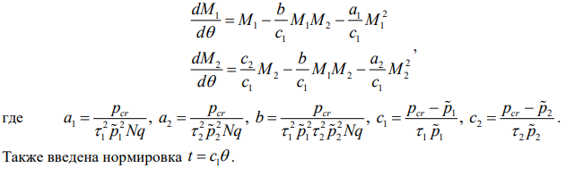
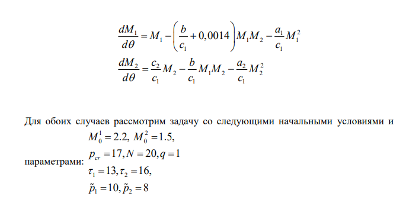
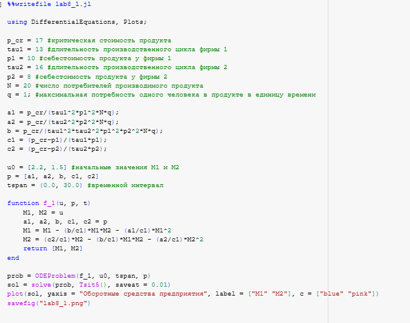
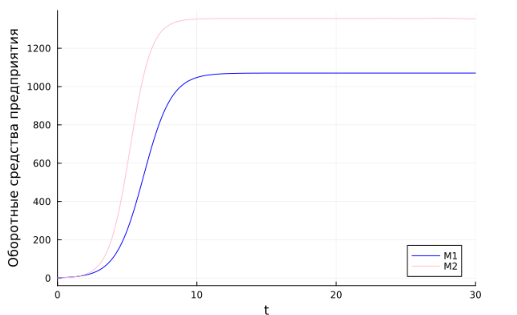
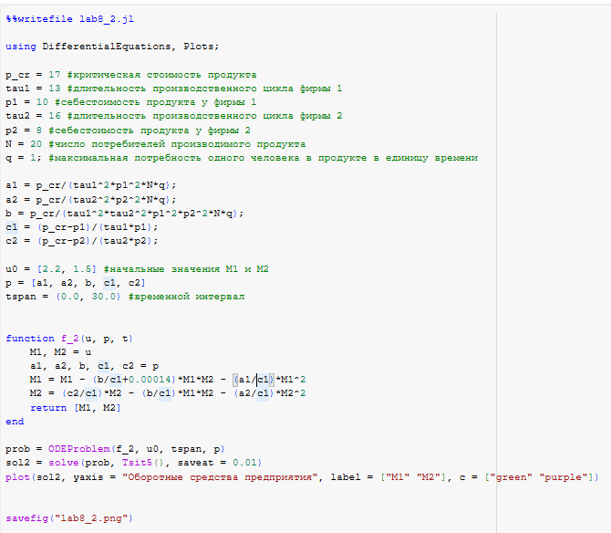
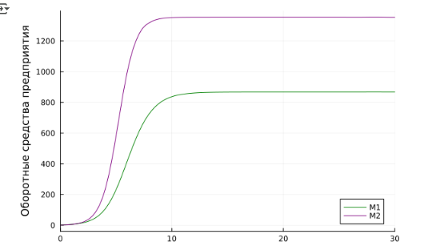
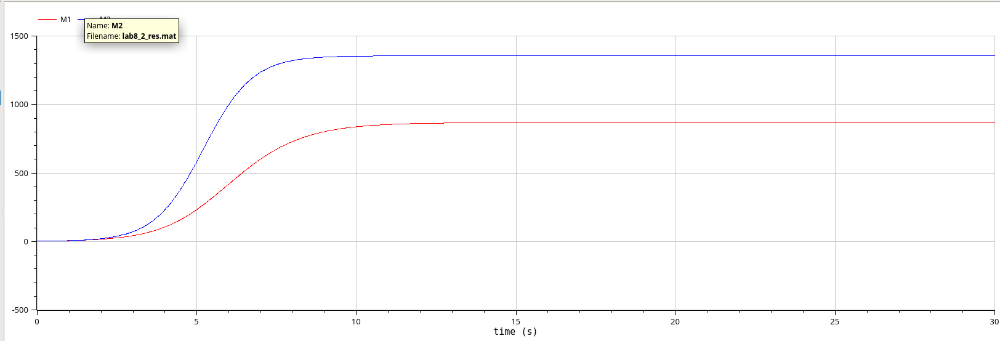

---
## Front matter
lang: ru-RU
title: " Лабораторная работа 8"
subtitle: "Модель конкуренции двух фирм"
author:
  - Эспиноса Василита К.М.
institute:
  - Российский университет дружбы народов, Москва, Россия

date: 31/05/2025

## i18n babel
babel-lang: russian
babel-otherlangs: english

## Formatting pdf
toc: false
toc-title: Содержание
slide_level: 2
aspectratio: 169
section-titles: true
theme: metropolis
header-includes:
 - \metroset{progressbar=frametitle,sectionpage=progressbar,numbering=fraction}
---

# Информация

## Докладчик

:::::::::::::: {.columns align=center}
::: {.column width="70%"}

* Эспиноса Василита Кристина Микаела  
* студентка  
* Российский университет дружбы народов  
* [1032224624@pfur.ru](mailto:1032224624@pfur.ru)  
* <https://github.com/crisespinosa/>

:::
::: {.column width="30%"}

:::
::::::::::::::

# Цель работы

Исследовать математическую модель конкуренции двух фирм.

# Задание

**Случай 1**

Рассмотрим две фирмы, производящие взаимозаменяемые товары
одинакового качества и находящиеся в одной рыночной нише. Считаем, что в рамках
нашей модели конкурентная борьба ведётся только рыночными методами. То есть,
конкуренты могут влиять на противника путем изменения параметров своего
производства: себестоимость, время цикла, но не могут прямо вмешиваться в
ситуацию на рынке («назначать» цену или влиять на потребителей каким-либо иным
способом.) Будем считать, что постоянные издержки пренебрежимо малы, и в
модели учитывать не будем. В этом случае динамика изменения объемов продаж
фирмы 1 и фирмы 2 описывается следующей системой уравнений:

{#fig:001 width=70%}

# Задание

**Случай 2**
Рассмотрим модель, когда, помимо экономического фактора
влияния (изменение себестоимости, производственного цикла, использование
кредита и т.п.), используются еще и социально-психологические факторы –
формирование общественного предпочтения одного товара другому, не зависимо от
их качества и цены. В этом случае взаимодействие двух фирм будет зависеть друг
от друга, соответственно коэффициент перед
M M1 2
будет отличаться. Пусть в
рамках рассматриваемой модели динамика изменения объемов продаж фирмы 1 и
фирмы 2 описывается следующей системой уравнений:

{#fig:002 width=70%}


# Выполнение лабораторной работы

# Реализация на Julia

Подключаем нужные библиотеки для решения ДУ и для отрисовки графиков. Задаем само дифференциальное уравнение, а также начальные условия и параметры. 

# Реализация на Julia

**Случай 1**

Зададим функцию, описывающую систему уравнений для этого случая, Далее решаем систему ДУ, сначала определив проблему с помощью метода ODEProblem(), а затем решим с помощью solve() солвером Tsit5() с шагом 0.01. Нарисуем график с помощью plot().

{#fig:003 width=70%}

# Реализация на Julia

{#fig:004 width=70%}

# Реализация на Julia

**Случай 2**

{#fig:005 width=70%}

# Реализация на Julia

{#fig:006 width=70%}


# Реализация на OpenModelica

**Случай 1**

```
parameter Real p_cr = 17;
  parameter Real tau1 = 13; 
  parameter Real p1 = 10;
  parameter Real tau2 = 16;
  parameter Real p2 = 8; 
  parameter Real N = 20;
  parameter Real q = 1;
  parameter Real a1 = p_cr/(tau1^2*p1^2*N*q);
  parameter Real a2 = p_cr/(tau2^2*p2^2*N*q);
  parameter Real b = p_cr/(tau1^2*tau2^2*p1^2*p2^2*N*q); 
  parameter Real c1 = (p_cr-p1)/(tau1*p1);
  parameter Real c2 = (p_cr-p2)/(tau2*p2);
  
  Real M1(start=2.2);
  Real M2(start=1.5);
  
equation

  der(M1) = M1 - (b/c1)*M1*M2 - (a1/c1)*M1^2;
  der(M2) = (c2/c1)*M2 - (b/c1)*M1*M2 - (a2/c1)*M2^2;
```
# Реализация на OpenModelica

{#fig:007 width=70%}

# Реализация на OpenModelica

**Случай 2**


```

 parameter Real p_cr = 17;
  parameter Real tau1 = 13; 
  parameter Real p1 = 10;
  parameter Real tau2 = 16;
  parameter Real p2 = 8; 
  parameter Real N = 20;
  parameter Real q = 1;
  parameter Real a1 = p_cr/(tau1^2*p1^2*N*q);
  parameter Real a2 = p_cr/(tau2^2*p2^2*N*q);
  parameter Real b = p_cr/(tau1^2*tau2^2*p1^2*p2^2*N*q); 
  parameter Real c1 = (p_cr-p1)/(tau1*p1);
  parameter Real c2 = (p_cr-p2)/(tau2*p2);
  
  Real M1(start=2.2);
  Real M2(start=1.5);
  
equation

  der(M1) = M1 - (b/c1+0.00014)*M1*M2 - (a1/c1)*M1^2;
  der(M2) = (c2/c1)*M2 - (b/c1)*M1*M2 - (a2/c1)*M2^2;

```

# Реализация на OpenModelica

{#fig:008 width=70%}


# Сравнение построения модели на Julia и в OpenModelica

Все графики получились идентичными. Что Julia, что OpenModelica справились с решением системы ДУ и построением графиков.

# Выводы

В результате выполнения лабораторной работы была исследована модель конкуренции двух фирм.
