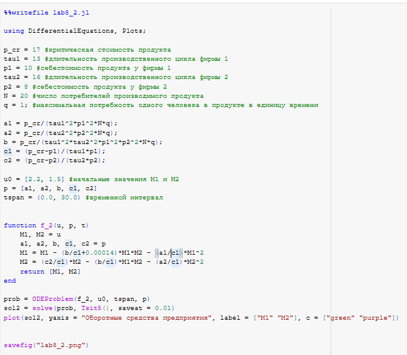

---
## Front matter
title: "Лабораторная работа №8"
subtitle: "Модель конкуренции двух фирм"
author: "Эспиноса Василита Кристина Микаела"

## Generic otions
lang: ru-RU
toc-title: "Содержание"

## Bibliography
bibliography: bib/cite.bib
csl: pandoc/csl/gost-r-7-0-5-2008-numeric.csl

## Pdf output format
toc: true # Table of contents
toc-depth: 2
lof: true # List of figures
lot: true # List of tables
fontsize: 12pt
linestretch: 1.5
papersize: a4
documentclass: scrreprt
## I18n polyglossia
polyglossia-lang:
  name: russian
  options:
	- spelling=modern
	- babelshorthands=true
polyglossia-otherlangs:
  name: english
## I18n babel
babel-lang: russian
babel-otherlangs: english
## Fonts
mainfont: IBM Plex Serif
romanfont: IBM Plex Serif
sansfont: IBM Plex Sans
monofont: IBM Plex Mono
mathfont: STIX Two Math
mainfontoptions: Ligatures=Common,Ligatures=TeX,Scale=0.94
romanfontoptions: Ligatures=Common,Ligatures=TeX,Scale=0.94
sansfontoptions: Ligatures=Common,Ligatures=TeX,Scale=MatchLowercase,Scale=0.94
monofontoptions: Scale=MatchLowercase,Scale=0.94,FakeStretch=0.9
mathfontoptions:
## Biblatex
biblatex: true
biblio-style: "gost-numeric"
biblatexoptions:
  - parentracker=true
  - backend=biber
  - hyperref=auto
  - language=auto
  - autolang=other*
  - citestyle=gost-numeric
## Pandoc-crossref LaTeX customization
figureTitle: "Рис."
tableTitle: "Таблица"
listingTitle: "Листинг"
lofTitle: "Список иллюстраций"
lotTitle: "Список таблиц"
lolTitle: "Листинги"
## Misc options
indent: true
header-includes:
  - \usepackage{indentfirst}
  - \usepackage{float} # keep figures where there are in the text
  - \floatplacement{figure}{H} # keep figures where there are in the text
---

# Цель работы

Исследовать математическую модель конкуренции двух фирм.

# Задание

**Случай 1**

Рассмотрим две фирмы, производящие взаимозаменяемые товары
одинакового качества и находящиеся в одной рыночной нише. Считаем, что в рамках
нашей модели конкурентная борьба ведётся только рыночными методами. То есть,
конкуренты могут влиять на противника путем изменения параметров своего
производства: себестоимость, время цикла, но не могут прямо вмешиваться в
ситуацию на рынке («назначать» цену или влиять на потребителей каким-либо иным
способом.) Будем считать, что постоянные издержки пренебрежимо малы, и в
модели учитывать не будем. В этом случае динамика изменения объемов продаж
фирмы 1 и фирмы 2 описывается следующей системой уравнений:

{#fig:001 width=70%}

**Случай 2**
Рассмотрим модель, когда, помимо экономического фактора
влияния (изменение себестоимости, производственного цикла, использование
кредита и т.п.), используются еще и социально-психологические факторы –
формирование общественного предпочтения одного товара другому, не зависимо от
их качества и цены. В этом случае взаимодействие двух фирм будет зависеть друг
от друга, соответственно коэффициент перед
M M1 2
будет отличаться. Пусть в
рамках рассматриваемой модели динамика изменения объемов продаж фирмы 1 и
фирмы 2 описывается следующей системой уравнений:

{#fig:002 width=70%}

# Теоретическое введение

Математическому моделированию процессов конкуренции и сотрудничества двух фирм на различных рынках посвящено довольно много научных работ, в основном использующих аппарат теории игр и статистических решений. В качестве примера можно привести работы таких исследователей, как Курно, Стакельберг, Бертран, Нэш, Парето [@model].

Следует отметить, что динамические дифференциальные модели уже давно и успешно используются для математического моделирования самых разнообразных по своей природе процессов. Достаточно упомянуть широко использующуюся в экологии модель «хищник-жертва» Вольтерра, математическую теорию развития эпидемий, модели боевых действий.

## Постановка задачи

Задача решалась в следующей постановке.

На рынке однородного товара присутствуют две основные фирмы, разделяющие его между собой, т.е. имеет место классическая дуополия.

Безусловно, это является весьма сильным предположением, однако оно вполне оправдано в тех случаях, когда доля продаж остальных конкурентов на рассматриваемом сегменте рынке пренебрежимо мала. Хорошим примером может служить отечественный рынок микропроцессоров, который по существу разделили между собой две фирмы: Intel и AMD.

Изменение объемов продаж конкурирующих фирм с течением времени описывается следующей системой дифференциальных уравнений:

\[
\begin{cases}
\frac{dM_1}{d\theta} = M_1 - \frac{b}{c_1} M_1 M_2 - \frac{a_1}{c_1} M_1^2 \\
\frac{dM_2}{d\theta} = \frac{c_2}{c_1} M_2 - \frac{b}{c_1} M_1 M_2 - \frac{a_2}{c_1} M_2^2
\end{cases}
\]

где:

- \( a_1 = \dfrac{p_{cr}}{\tau_1^2 \tilde{p}_1^2 N q} \)
- \( a_2 = \dfrac{p_{cr}}{\tau_2^2 \tilde{p}_2^2 N q} \)
- \( b = \dfrac{p_{cr}}{\tau_1^2 \tau_2^2 \tilde{p}_1^2 \tilde{p}_2^2 N q} \)
- \( c_1 = \dfrac{p_{cr} - p_1}{\tau_1 \tilde{p}_1} \)
- \( c_2 = \dfrac{p_{cr} - p_2}{\tau_2 \tilde{p}_2} \)

Обозначения:
- \( N \) — число потребителей производимого продукта.
- \( \tau \) — длительность производственного цикла.
- \( p \) — рыночная цена товара.
- \( \tilde{p} \) — себестоимость продукта, т.е. переменные издержки на единицу продукции.
- \( q \) — максимальная потребность одного человека в продукте в единицу времени.
- \( \theta = \frac{t}{c_1} \) — безразмерное время.


# Выполнение лабораторной работы

## Реализация на Julia

Подключаем нужные библиотеки для решения ДУ и для отрисовки графиков. Задаем само дифференциальное уравнение, а также начальные условия и параметры. 

**Случай 1**

Зададим функцию, описывающую систему уравнений для этого случая, Далее решаем систему ДУ, сначала определив проблему с помощью метода ODEProblem(), а затем решим с помощью solve() солвером Tsit5() с шагом 0.01. Нарисуем график с помощью plot().

{#fig:003 width=70%}


В результате численного решения системы дифференциальных уравнений для конкурирующих фирм без учета постоянных издержек и с введенной нормировкой времени получаем следующий график изменения оборотных средств фирмы 1 и фирмы 2.
По графику видно, что рост оборотных средств обеих фирм происходит независимо. Обе фирмы достигают определенного устойчивого уровня, после чего объемы стабилизируются. 

В модели этот эффект отражается в одинаковом коэффициенте взаимодействия \( \frac{b}{c_1} \), стоящем перед смешанным членом \( M_1 M_2 \) в обоих уравнениях. Это означает симметричную конкуренцию без предпочтения одной из фирм.

Таким образом, каждая фирма захватывает свою долю рынка, которая не изменяется с течением времени, и они продолжают сосуществовать.


{#fig:004 width=70%}

**Случай 2**

{#fig:005 width=70%}

В случае добавления небольшого асимметричного социального влияния на одну из фирм (например, предпочтения потребителей), система динамики изменяется. Полученный график показан ниже.

{#fig:006 width=70%}

Как видно, фирма 1 (зелёная линия) сначала растет, но затем начинает снижать оборотные средства и в итоге банкротится. В то же время фирма 2 (фиолетовая линия) стабильно выходит на устойчивый максимум и полностью занимает рынок.

Это демонстрирует, как даже незначительное преимущество в восприятии потребителей может привести к полному вытеснению конкурента, несмотря на близкие стартовые условия.


## Реализация на OpenModelica

**Случай 1**


Здесь мы задаем параметры, начальные условия, ДУ и выполняем симуляцию на том же интервале и с тем же шагом, что и в Julia.

```
parameter Real p_cr = 17;
  parameter Real tau1 = 13; 
  parameter Real p1 = 10;
  parameter Real tau2 = 16;
  parameter Real p2 = 8; 
  parameter Real N = 20;
  parameter Real q = 1;
  parameter Real a1 = p_cr/(tau1^2*p1^2*N*q);
  parameter Real a2 = p_cr/(tau2^2*p2^2*N*q);
  parameter Real b = p_cr/(tau1^2*tau2^2*p1^2*p2^2*N*q); 
  parameter Real c1 = (p_cr-p1)/(tau1*p1);
  parameter Real c2 = (p_cr-p2)/(tau2*p2);
  
  Real M1(start=2.2);
  Real M2(start=1.5);
  
equation

  der(M1) = M1 - (b/c1)*M1*M2 - (a1/c1)*M1^2;
  der(M2) = (c2/c1)*M2 - (b/c1)*M1*M2 - (a2/c1)*M2^2;
```
В результате численного решения системы дифференциальных уравнений для конкурирующих фирм без учета постоянных издержек и с введенной нормировкой времени получаем следующий график изменения оборотных средств фирмы 1 и фирмы 2.
По графику видно, что рост оборотных средств обеих фирм происходит независимо. Обе фирмы достигают определенного устойчивого уровня, после чего объемы стабилизируются. 

В модели этот эффект отражается в одинаковом коэффициенте взаимодействия \( \frac{b}{c_1} \), стоящем перед смешанным членом \( M_1 M_2 \) в обоих уравнениях. Это означает симметричную конкуренцию без предпочтения одной из фирм.

Таким образом, каждая фирма захватывает свою долю рынка, которая не изменяется с течением времени, и они продолжают сосуществовать.

{#fig:007 width=70%}

**Случай 2**

Задаем параметры, начальные условия, ДУ и выполняем симуляцию на том же интервале и с тем же шагом, что и в Julia.

```

 parameter Real p_cr = 17;
  parameter Real tau1 = 13; 
  parameter Real p1 = 10;
  parameter Real tau2 = 16;
  parameter Real p2 = 8; 
  parameter Real N = 20;
  parameter Real q = 1;
  parameter Real a1 = p_cr/(tau1^2*p1^2*N*q);
  parameter Real a2 = p_cr/(tau2^2*p2^2*N*q);
  parameter Real b = p_cr/(tau1^2*tau2^2*p1^2*p2^2*N*q); 
  parameter Real c1 = (p_cr-p1)/(tau1*p1);
  parameter Real c2 = (p_cr-p2)/(tau2*p2);
  
  Real M1(start=2.2);
  Real M2(start=1.5);
  
equation

  der(M1) = M1 - (b/c1+0.00014)*M1*M2 - (a1/c1)*M1^2;
  der(M2) = (c2/c1)*M2 - (b/c1)*M1*M2 - (a2/c1)*M2^2;

```

Получаем график:

{#fig:008 width=70%}


## Сравнение построения модели на Julia и в OpenModelica

Все графики получились идентичными. Что Julia, что OpenModelica справились с решением системы ДУ и построением графиков.

# Выводы

В результате выполнения лабораторной работы была исследована модель конкуренции двух фирм.

# Список литературы{.unnumbered}

::: {#refs}
:::
